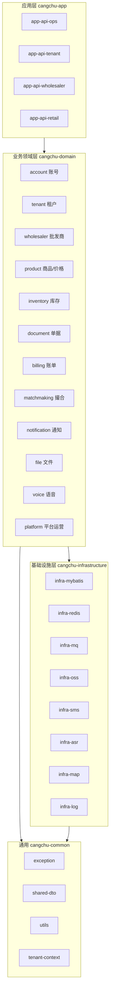
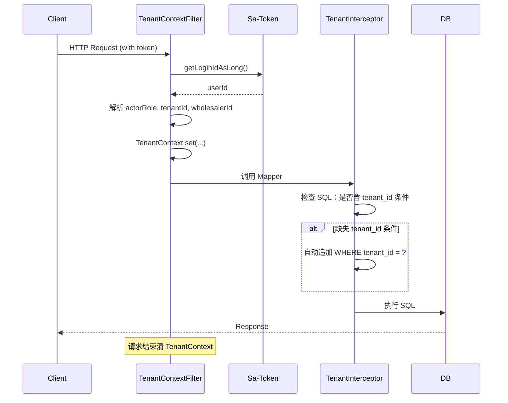

# 02 · 模块划分与依赖关系（v1）

> 项目：仓储云
> 版本：v1 · 2026-06-02
> 编写：架构师 Agent
> 依赖：99-arch-decisions.md / 01-tech-stack.md / PRD 03 信息架构
> 状态：草案 → 待 Team Lead 复核

---

## 0. 文档说明

本文档定义模块化单体的内部模块边界、依赖关系、对外接口契约。所有模块在编译期检查依赖方向，禁止循环依赖。

阅读对象：
- 后端开发 Agent：依据本文档划分代码结构、定义包路径、设计 service 接口
- 测试 Agent：依据本文档识别模块边界做集成测试
- Team Lead：依据本文档分配 task 给后端开发

---

## 1. 模块总览

平台按业务能力划分为 **3 个层级 / 14 个模块**：



**依赖原则**：
1. 严格单向依赖：app → domain → infra → common
2. 同层模块之间允许"业务领域"模块互相依赖（如 document → inventory）
3. 禁止 domain 反向依赖 app；禁止 infra 反向依赖 domain
4. 编译期通过 ArchUnit 校验依赖方向

---

## 2. 业务领域模块详解

### 2.1 domain-account（账号模块）★ 核心

**职责**：
- 用户注册（7 个入口，含 OPS 代建、邀请码注册、RT 验证码注册）
- 登录 / 退出（密码 / 验证码 / 多角色路由）
- 改密 / 找回密码 / 换绑手机号
- 短信验证码生成 / 校验（4 个场景）
- 邀请码（店铺码 + 员工注册码）生成 / 校验
- 多角色绑定（UserRole 表 CRUD）
- 会话管理（Sa-Token 集成）

**对外接口（service 层）**：
```
AccountService
  - register(RegisterDto) → AccountVo
  - login(LoginDto) → LoginVo (含 token)
  - logout(token)
  - changePassword(...)
  - resetPassword(...)
  - changePhone(...)
  - sendSmsCode(phone, scene)
  - verifySmsCode(phone, scene, code)

UserRoleService
  - listRoles(userId) → List<UserRole>
  - addRole(userId, role, tenantId/wholesalerId)
  - removeRole(...)
  - resolvePrimaryRole(userId) → Role  // 多角色优先级路由

InviteCodeService
  - generateStoreCode(tenantId) → code
  - generateEmployeeCode(tenantId or wholesalerId, role, expireDays, maxUses) → code
  - verifyAndConsume(code, phone) → InviteContext
```

**对内依赖**：
- infra-redis（验证码、会话）
- infra-sms（发短信）
- infra-log（注册/改密日志）

**对外被依赖**：
- 所有业务模块（用户鉴权）
- domain-tenant（TA 注册 → 创建 Tenant）
- domain-wholesaler（WA 入驻 → 创建 Wholesaler）

**关键设计**：
- 多角色：单 User → N UserRole；登录时 Sa-Token 同 namespace 共享 token，OPS/RT 走独立 namespace
- 兼任处理：登录路由 `TA > ST > WK > WA > WE`（在 `resolvePrimaryRole` 实现）
- RT 验证码登录：未注册自动创建（同事务）
- 改密/换绑 → 调 `StpUtil.kickout(userId)` 全设备踢出

---

### 2.2 domain-tenant（租户模块）

**职责**：
- 租户 CRUD（自助注册 + OPS 代建两条路径）
- 租户审核（OPS 审批）
- 租户冻结 / 解冻 / 下线
- 店铺基础信息（与 Tenant 1:1，但概念分离）
- 计费规则（BillingRule，含 件·天 / 托盘·天 / 临期阈值）
- 5 个 TA 级开关：批次管理 / 入库拍照 / 容量公示 / 计费维度 / 临期阈值
- 容量公示算法（10 分钟快照 + Redis 缓存）

**对外接口**：
```
TenantService
  - createBySelfRegister(...)
  - createByOps(...)
  - approve(tenantId, OPS_userId)
  - freeze(tenantId, OPS_userId)
  - getTenantSettings(tenantId) → TenantSettingsVo (5 开关 + 容量配置)
  - updateBatchSwitch(tenantId, enable) // 含批次切换联动副作用
  - updatePhotoSwitch(tenantId, mode)
  - updateCapacityVisibility(tenantId, ...)
  - updateBillingRule(tenantId, BillingRuleDto)

CapacityService
  - getCapacitySnapshot(tenantId, viewerRole) → CapacityVo (含精度档位脱敏)
  - refreshSnapshot(tenantId)  // 内部 + Job 调用
```

**对内依赖**：
- domain-account（验证用户身份）
- infra-redis（容量快照、TA 操作限频）
- infra-mq（开关切换通知）
- infra-log

**对外被依赖**：
- domain-wholesaler（入驻关系）
- domain-billing（取计费规则）
- domain-inventory（容量计算引用）
- domain-document（开关行为依赖）

**关键设计**：
- 开关切换有"联动副作用"：批次开关切换会触发 Inventory + Batch + ExpiryWarning 联动（通过 EventBus 异步处理）
- 容量公示精度档位在 service 层根据 viewer 角色脱敏

---

### 2.3 domain-wholesaler（批发商模块）

**职责**：
- 批发商 CRUD（自助申请 + OPS 代建 + TA 自营创建）
- 入驻审核（TA 审批 / OPS 代建跳过）
- 退驻申请 / 强制下架 / 黑名单
- 撮合资料（介绍、主推 SKU、营业资质）
- 入驻状态机管理

**对外接口**：
```
WholesalerService
  - applyToTenant(wholesalerDto, tenantId, applicantUserId)
  - approveByTa(applicationId, taUserId, approve)
  - createByOps(...)  // 需 TA 授权或客诉单 ID
  - createSelfOperated(tenantId, ...)  // TA 自营
  - withdraw(wholesalerId, applicantUserId)  // R13
  - forceOffline(wholesalerId, taUserId, reason)  // R14
  - updateProfile(wholesalerId, ...)

BlacklistService (OPS)
  - addToBlacklist(phone/license, reason, OPS_userId)
  - removeFromBlacklist(...)
  - isBlacklisted(phone/license) → boolean
```

**对内依赖**：
- domain-account
- domain-tenant（验证租户有效）
- infra-mq（入驻通知）
- infra-log

**对外被依赖**：
- domain-product（SKU 属于 wholesaler）
- domain-document（单据 wholesaler_id）
- domain-billing

**关键设计**：
- 入驻关系状态机见 PRD 04 §1.8
- 退驻前置校验委托给 InventoryService.assertZeroStock + BillingService.assertAllSettled
- 黑名单全平台共享，新入驻申请必检

---

### 2.4 domain-product（商品与价格模块）★ 核心

**职责**：
- SPU 维护（OPS 平台级）
- SKU 维护（WA 商户级）
- 规格类型 / 规格值（SpecType / SpecValue 平台共享）
- SKU 展示图（标准图 / 入库实拍 / 双图轮播）
- **公开价**（单价 + 起批价 + 起批量）
- **客户专属价**（(rt_phone, sku) 二元组）
- 价格匹配算法（PRD §14b.1）
- 议价沉淀（PRD §14b.2）
- 批量调价（PRD §14b.4）
- 调价历史（PriceChangeLog）

**对外接口**：
```
SpuService (OPS)
  - createSpu(...) / mergeSpu(...) / offlineSpu(...)

SkuService (WA/WE)
  - createSku(spuId, wholesalerId, specs, prices, ...)
  - updateSku(...)
  - listByTenantForRt(tenantId, filters, rtPhone) → List<SkuVo>  // 自动应用价格匹配
  - toggleListing(skuId, on/off)

PriceService ★
  - resolvePrice(skuId, rtPhone, qty) → PriceResolveVo  // 价格匹配核心
  - createCustomerPrice(...)
  - batchUpdatePublicPrice(skuIds, strategy)  // 涨/降 X% / 改为 ¥X / 加减 ¥X
  - batchUpdateCustomerPrice(...)
  - expireCustomerPrice(...)
  - applySettlementFromInquiry(inquiryId, dealPrice, sinkOption)  // 沉淀
  - listCustomerPrices(filters) / listChangeLogs(filters)
```

**对内依赖**：
- domain-account
- domain-tenant
- domain-wholesaler
- infra-redis（价格缓存：sku 公开价 / 专属价命中表）
- infra-log

**对外被依赖**：
- domain-document（询价 / 出库取价快照）
- domain-inventory（SKU 引用）

**关键设计**：
- 价格匹配 ≤200ms：Redis Hash `price:cp:{phone}` → sku_id → price，Miss 时查 DB + 回写
- 批量调价用 Redisson 分布式锁防并发
- 沉淀触发点在 InquiryService.confirm() 内同事务调用 `applySettlementFromInquiry`

---

### 2.5 domain-inventory（库存模块）★ 核心

**职责**：
- 批次（Batch）管理（启用时生效）
- 库存（Inventory）按 (sku, batch) 或 (sku) 维度
- 流水（StockMovement）5 种类型：入库 / 出库 / 退货 / 盘盈 / 盘亏 / 临期清库
- FIFO 拣货算法（PRD §2.1 / §2.2 / §2.3）
- 托盘释放算法（PRD §3.3）
- 临期判定 + 临期预警生成
- 强制清库（ExpiryClearance）
- 库存查询（按租户/批发商/SKU/批次）
- 每日快照（DailySnapshot）生成 Job
- 入库照片归属管理

**对外接口**：
```
InventoryService ★
  - addStock(InboundContext) → MovementVo  // 入库流水
  - deductStock(OutboundContext) → MovementVo  // 出库流水，含 FIFO
  - returnStock(ReturnContext)
  - countSheetApply(CountSheetContext)  // 盘盈/盘亏
  - clearance(ExpiryContext)
  - reverseInboundForDispute(inboundId)  // 代建入库异议反向冲销
  - queryInventory(filters) → List<InventoryVo>
  - assertStockEnough(skuId, qty)
  - assertZeroStock(wholesalerId)  // R13 退驻前置
  - listBatchesForFifo(skuId) → List<Batch>  // FIFO 排序
  - listInStockSkusFor(wholesalerId) → List<SkuStockVo>  // 出库 SKU 下拉

BatchService
  - createBatch(skuId, batchNo, prodDate, expiryDate, source)
  - generateDefaultBatchOnSwitchOn(skuId)  // 关→启 切换占位
  - listExpiringBatches(thresholdDays)

ExpiryClearanceService
  - createSheet(...) → CountSheet (WK 发起)
  - approve(sheetId, taUserId)

DailySnapshotJob
  - run()  // 每日 00:00 触发
```

**对内依赖**：
- domain-tenant（批次开关 / 拍照开关 / 临期阈值）
- domain-product（SKU 引用）
- domain-file（入库照片）
- domain-document（单据反查）
- infra-redis（库存读缓存 + 分布式锁）
- infra-mq（异步事件：临期预警、入库照片同步至 SKU 展示图）
- infra-log

**对外被依赖**：
- domain-document（增删改库存）
- domain-billing（计费输入：DailySnapshot）
- domain-tenant（容量计算）

**关键设计**：
- 库存扣减 Redisson 锁粒度：`lock:inv:{wholesalerId}:{skuId}:{batchId?}`
- FIFO 算法在 service 层；DAO 层只提供 `listBatchesForFifo` 查询
- 批次开关切换的副作用集中在 `BatchService.handleSwitchEvent`，通过 EventBus 触发
- 库存增量与批次/流水写在同事务

---

### 2.6 domain-document（单据模块）★ 核心

**职责**：
- 入库申请单（InboundRequest）：WA 提交 + WK 代建（72h 默认接受 + 异议）
- 出库申请单（OutboundRequest）：WA 提交 + 意向单自动转 + WK 代建（不可异议）
- 询价单（Inquiry）：RT 提交 + WA 代下（含整单优惠）+ 议价
- 退货单（ReturnRequest）
- 盘点单（CountSheet）
- 临期清库单（ExpiryClearance，仅批次启用时）
- 单据号生成（Redis INCR）
- 单据状态机管理（统一框架）
- 单据打印（PDF 生成）
- WK 代建的 72h 倒计时任务

**对外接口**：
```
InboundRequestService
  - submitByWa(...) → InboundRequestVo
  - submitByWk(...)  // 代建
  - reject(id, wkUserId, reason)
  - withdraw(id, applicantUserId)
  - accept(id, wkUserId)
  - register(id, wkUserId, batchInfo, photos, palletQty)  // 实际入库登记
  - confirmByWa(id, waUserId)  // 代建接受
  - disputeByWa(id, waUserId, reason)  // 代建异议 → 反向冲销
  - autoAcceptAfter72h(id)  // Job 调用
  - arbitrateByTa(id, taUserId, approve)  // 仲裁

OutboundRequestService
  - submitByWa(...)
  - submitByWk(...)  // 代建，二次确认 + 大额校验
  - autoGenerateFromInquiry(inquiryId)  // 询价确认自动转
  - print(id) / register(id, ...)  // 出库登记
  - complaintByWa(id, reason, attachments)
  - arbitrateByOps(id, opsUserId, judgement)

InquiryService
  - submitByRt(...)
  - submitByWaProxy(...)  // WA 代下意向单
  - confirm(id, dealPrice, fullOrderDiscount, sinkOption)
  - reject(id, reason)
  - bargain(id, replyPrice)
  - rtCancel(id) / waVoid(id)  // R7 / R8

ReturnRequestService / CountSheetService / ExpiryClearanceService
  - 类似上述模式

DocumentNumberService
  - generate(DocType, tenantSimpleCode) → docNo  // Redis INCR
```

**对内依赖**：
- domain-account（操作人 / 权限）
- domain-tenant（开关）
- domain-wholesaler（归属）
- domain-product（SKU / 价格快照）
- domain-inventory（库存扣减 / 增加）
- domain-file（附件 / 入库照片）
- domain-voice（语音录音引用）
- domain-notification（推送）
- infra-mq（异步状态变更通知）
- infra-log

**关键设计**：
- 询价确认 → 自动生成出库单：单事务内（参见 PRD 04 §6.2）
- 入库登记 → 库存增加 + 计费起算 + 照片归档 + 展示图同步：单事务内
- 代建出库不可异议：状态机层面禁止从"已出库"回退
- 72h 倒计时 Job：XXL-Job 扫描 `待 WA 确认` 状态 且 `created_at + 72h ≤ now`
- 单据状态机抽象：`StateMachineEngine` 基类 + 各单据子类，事件驱动

---

### 2.7 domain-billing（账单模块）

**职责**：
- BillingRule（已挪到 domain-tenant，引用即可）
- DailySnapshot：每日 0 点生成
- Bill / BillItem：月度账单
- 账单调整（折扣 / 减免 / 冲销）
- 账单下发（推送 WA）
- 已收款登记 / 冲销（PaymentRecord）
- 账单申诉（BillDispute）
- 账单导出（PDF / Excel）
- 分段计费（R20 规则变更）

**对外接口**：
```
DailySnapshotJob
  - run()  // 每日 00:00

BillGenerateJob
  - run()  // 每月 1 日 00:00，发 MQ 任务

BillGenerateConsumer
  - onMessage(tenantId, wholesalerId, yyyyMM)
  - 调 BillingService.generateBill(...)

BillingService
  - generateBill(tenantId, wholesalerId, yyyyMM) → Bill
  - adjustBill(billId, adjustment, stUserId)
  - reverseBillItem(billItemId, stUserId)
  - dispatch(billId)
  - withdraw(billId)  // R11
  - registerPayment(billId, amount, attachments, stUserId)
  - reversePayment(paymentId, reason, stUserId)  // R12
  - exportBill(billId, format) → fileUrl

BillDisputeService
  - submit(billId, waUserId, items, attachments)
  - process(disputeId, stUserId, resolution)

BillingRuleResolver
  - resolveForDay(tenantId, date) → BillingRule  // R20 分段计费
```

**对内依赖**：
- domain-tenant（BillingRule）
- domain-wholesaler
- domain-inventory（DailySnapshot 来源）
- domain-notification
- infra-mq
- infra-oss（导出文件存储）
- infra-log

**关键设计**：
- 账单生成幂等键：`bill:{tenantId}:{wholesalerId}:{yyyyMM}`（参见 ADR-008）
- 分段计费：BillingRule 表保留历史版本（`effective_from` / `effective_to`），按日查找适用版本
- 计费聚合 SQL 优化：DailySnapshot 表带索引 `(tenant_id, wholesaler_id, snapshot_date)`
- 整单优惠不入仓储费（PRD §14b.8）

---

### 2.8 domain-matchmaking（撮合模块 · 轻量）

**职责**：
- 店铺撮合页（TA 编辑：介绍、主推商品、置顶批发商）
- 仓库广场（公开浏览）
- 容量公示与位置耦合（参见 domain-tenant 的 CapacityService 调用）
- 推荐仓库算法（RT 进店）
- 距离计算（调 infra-map）

**对外接口**：
```
StoreFrontService
  - getStorePage(tenantId, viewerRole) → StoreFrontVo
  - updateStoreFront(tenantId, dto)

WarehousePlazaService
  - searchTenants(filters, rtLocation) → List<TenantCardVo>
  - recommendForRt(rtLocation, sortMode) → List<TenantCardVo>

WholesalerProfileService
  - updateProfile(wholesalerId, dto)
  - listMainSkus(wholesalerId)
```

**对内依赖**：
- domain-tenant（容量、可见性）
- domain-wholesaler
- domain-product（主推 SKU）
- infra-map（高德距离）

---

### 2.9 domain-notification（通知模块）

**职责**：
- 站内信（Notification）CRUD
- 短信发送（通过 infra-sms）
- 推送（H5 PWA / 微信小程序，v2 完整）
- 通知幂等（同 event_id 24h 不重发）
- 通知模板管理

**对外接口**：
```
NotificationService
  - send(NotifyEvent)  // 异步入 MQ
  - listForUser(userId, filters) → List<NotificationVo>
  - markRead(notificationId, userId)

NotifyConsumer
  - onMessage(NotifyEvent)
  - 根据 channel 调 SmsProvider / 站内信 DB 写入 / Push API
```

**对内依赖**：
- infra-sms / infra-mq / infra-redis（幂等去重）

**对外被依赖**：所有业务模块发通知

---

### 2.10 domain-file（文件模块）

**职责**：
- OSS 上传 / 下载（含 STS 临时令牌）
- 入库照片归档（按批次 / 入库单）
- 展示图源管理（标准图 vs 入库实拍 vs 双图轮播）
- 文件元数据管理（attachment 表）
- 签名 URL 生成

**对外接口**：
```
FileService
  - issueStsToken(userId, scene) → StsTokenVo
  - uploadFromServer(bytes, path) → fileUrl
  - signGetUrl(ossKey, ttlMin) → signedUrl
  - registerAttachment(ownerType, ownerId, fileUrl, ...)

InboundPhotoService
  - linkToBatch(photoId, batchId)
  - listByBatch(batchId)
  - listLatestForSku(skuId)  // 展示图源 = 入库实拍时使用
```

**对内依赖**：
- infra-oss
- infra-log

---

### 2.11 domain-voice（语音模块）

**职责**：
- 录音文件上传 + OSS 路径分配
- 调用阿里云 NLS 转写
- NLU 字段抽取（SKU 模糊匹配 / 数字 / 日期 / 地址等）
- VoiceRecord 实体管理
- 30 天定时清理

**对外接口**：
```
VoiceService
  - startRealtimeAsr(userId) → wsSessionId
  - uploadVoiceFile(userId, bytes) → voiceRecordId
  - extractFields(voiceRecordId, scene) → ExtractedFields
  - cleanExpired()  // Job，每日清理 30 天前
```

**对内依赖**：
- infra-asr / infra-oss
- domain-product（SKU 模糊匹配查 SkuService）

---

### 2.12 domain-platform（平台运营模块）

**职责**：
- 平台公告（Announcement）
- 客诉单（Complaint）
- 平台版本发布
- 系统监控数据查询接口（OPS 后台用）

**对外接口**：
```
AnnouncementService
  - create(...) / list(targetRole) / markRead(...)

ComplaintService
  - submit(complainantUserId, ...)
  - assign(complaintId, opsUserId)
  - resolve(complaintId, judgement)
```

---

## 3. 基础设施模块详解

### 3.1 infra-mybatis

**职责**：
- MyBatis-Plus 配置
- TenantInterceptor（多租户拦截器 ADR-007）
- 字段自动填充（created_at / updated_at / created_by / tenant_id）
- 分页插件 / 乐观锁插件
- TenantLeakDetector（测试用）

**关键类**：
```
TenantContext           // ThreadLocal<TenantInfo>
TenantInterceptor       // MyBatis 拦截器：自动注入 tenant_id 条件
TenantContextFilter     // HTTP Filter：从 Sa-Token 提取 tenant_id 入 TenantContext
SnowflakeIdGenerator    // 雪花 ID
MybatisMetaObjectHandler // 自动填充
```

### 3.2 infra-redis

**职责**：
- RedisTemplate 配置
- Redisson 配置
- Key 规范工具类（`RedisKeys.smsCode(phone, scene)` 等）

### 3.3 infra-mq

**职责**：
- RocketMQ 配置
- Topic 与 ConsumerGroup 约定
- 消息体抽象（基类 `BaseEvent`，含 eventId / occurredAt）

**Topic 清单**：
| Topic | Producer | Consumer | 用途 |
|---|---|---|---|
| notification | 业务模块 | NotifyConsumer | 站内信 / 短信发送 |
| bill-generate | BillGenerateJob | BillGenerateConsumer | 账单异步生成 |
| voice-asr | 业务 | VoiceConsumer | 异步转写 |
| inventory-event | InventoryService | 多消费者 | 库存事件（临期、容量刷新触发） |
| document-event | DocumentService | 多消费者 | 单据状态变更（通知、价格沉淀）|

### 3.4 infra-oss

**职责**：
- OSS Client 封装
- STS 临时令牌签发
- Bucket 路径规范
- 签名 URL

### 3.5 infra-sms

**职责**：
- SmsProvider 接口（抽象）
- AliyunSmsProvider 实现 + TencentSmsProvider 实现（容灾）
- 失败重试 + Provider 切换逻辑

### 3.6 infra-asr

**职责**：
- AsrProvider 接口
- AliyunNlsProvider 实现
- 实时识别 WebSocket 转发

### 3.7 infra-map

**职责**：
- MapProvider 接口
- AmapProvider 实现（含逆向地理编码、距离测量、IP 定位）
- 距离计算（Haversine 公式，本地实现兜底）

### 3.8 infra-log

**职责**：
- `@OperationLog` 注解
- AOP 切面 + Disruptor 队列
- 日志写入 operation_log 表 + OSS 归档

---

## 4. 应用层模块

### 4.1 app-api-ops

**职责**：OPS PC 后台 API 入口
**路径前缀**：`/api/v1/ops/`
**鉴权**：`StpOpsUtil` namespace

**关键资源**：
- /tenants （审核 / 代建 / 下线 / 冻结）
- /spus
- /blacklist
- /announcements
- /complaints

### 4.2 app-api-tenant

**职责**：TA / WK / ST 共用 API（按角色权限差异化）
**路径前缀**：`/api/v1/tenant/`
**鉴权**：`StpUtil` 主体系 + 角色注解 `@SaCheckRole({"TA","WK","ST"})`

### 4.3 app-api-wholesaler

**职责**：WA / WE API
**路径前缀**：`/api/v1/wholesaler/`

### 4.4 app-api-retail

**职责**：RT API（公开 + 鉴权混合）
**路径前缀**：`/api/v1/rt/`
**鉴权**：`StpRtUtil` namespace；浏览类接口免登录

---

## 5. 共享内核（cangchu-common）

### 5.1 异常体系

```
BusinessException(errorCode, message, args)
PermissionException
ValidationException
StateException
SystemException
```

所有 Service 抛 BusinessException 及其子类；GlobalExceptionHandler 统一捕获 → JSON 响应。

### 5.2 通用 DTO

```
PageRequest / PageResponse<T>
ApiResponse<T>     // 统一响应包装
BaseDto / BaseVo
```

### 5.3 TenantContext

```
TenantContext.current() → TenantInfo {tenantId, wholesalerId, userId, actorRole}
TenantContext.clearForGlobalQuery()  // OPS 跨租户查询
```

### 5.4 工具类

- SnowflakeId
- PhoneUtil
- BcryptUtil
- AmountUtil（金额精度处理）
- DateUtil

---

## 6. 模块依赖矩阵（避免循环）

横向 = 调用方，纵向 = 被调用方：

| ↓被 / 调→ | account | tenant | whlsr | product | invtry | doc | bill | match | notif | file | voice | plat |
|---|---|---|---|---|---|---|---|---|---|---|---|---|
| account |  | ❌ | ❌ | ❌ | ❌ | ❌ | ❌ | ❌ | ❌ | ❌ | ❌ | ❌ |
| tenant | ✓ |  | ❌ | ❌ | ❌ | ❌ | ❌ | ❌ | ❌ | ❌ | ❌ | ❌ |
| whlsr | ✓ | ✓ |  | ❌ | ❌ | ❌ | ❌ | ❌ | ❌ | ❌ | ❌ | ❌ |
| product | ✓ | ✓ | ✓ |  | ❌ | ❌ | ❌ | ❌ | ❌ | ❌ | ❌ | ❌ |
| invtry | ✓ | ✓ | ✓ | ✓ |  | ❌ | ❌ | ❌ | ❌ | ✓ | ❌ | ❌ |
| doc | ✓ | ✓ | ✓ | ✓ | ✓ |  | ❌ | ❌ | ✓ | ✓ | ✓ | ❌ |
| bill | ✓ | ✓ | ✓ | ❌ | ✓ | ❌ |  | ❌ | ✓ | ✓ | ❌ | ❌ |
| match | ✓ | ✓ | ✓ | ✓ | ❌ | ❌ | ❌ |  | ❌ | ❌ | ❌ | ❌ |
| notif | ✓ | ❌ | ❌ | ❌ | ❌ | ❌ | ❌ | ❌ |  | ❌ | ❌ | ❌ |
| file | ✓ | ❌ | ❌ | ❌ | ❌ | ❌ | ❌ | ❌ | ❌ |  | ❌ | ❌ |
| voice | ✓ | ❌ | ❌ | ✓ | ❌ | ❌ | ❌ | ❌ | ❌ | ✓ |  | ❌ |
| plat | ✓ | ✓ | ✓ | ❌ | ❌ | ❌ | ❌ | ❌ | ✓ | ❌ | ❌ |  |

✓ = 允许；❌ = 不允许（违反则编译期 ArchUnit 拦截）

**关键约束**：
- account 是最底层域，不依赖任何业务域
- document 是最依赖域（调度多个业务模块完成一次业务事务）
- billing 依赖 inventory 但 inventory 不反向依赖 billing
- 跨域通信优先用领域事件（infra-mq），减少强耦合

---

## 7. 共享内核：TenantContext 与多租户落地



**强制规则**：
1. 所有业务表必含 `tenant_id`，平台级表（spu / blacklist / announcement / spec_type 等）通过白名单标注豁免
2. 任何 Mapper 方法不显式声明 `@TenantSkip`，TenantInterceptor 必须保证 SQL 内含 `tenant_id` 条件
3. OPS 跨租户查询：在 Service 显式 `TenantContext.clearForGlobalQuery()` 后调 Mapper，并记录 OperationLog

---

## 8. 领域事件清单（事件驱动通信）

| 事件 | 发起模块 | 订阅模块 | 处理动作 |
|---|---|---|---|
| InboundRegisteredEvent | document | inventory / file / product | 库存增 / 入库照片归档 / 展示图源同步 |
| OutboundRegisteredEvent | document | inventory / notification | 库存扣减 / 通知 RT+WA |
| InquiryConfirmedEvent | document | product / document / notification | 价格沉淀 / 自动生成出库 / 通知 |
| BatchSwitchedEvent | tenant | inventory | 默认批次生成 / 临期预警停用 |
| PhotoSwitchedEvent | tenant | product | SKU 展示图源回退 |
| CapacityChangedEvent | inventory | tenant | 容量快照失效（DEL 缓存） |
| BillGeneratedEvent | billing | notification | ST 站内信 |
| ComplaintCreatedEvent | platform | notification | OPS 推送 |
| WaWithdrawnEvent | wholesaler | product / notification | 客户专属价批量失效 |

**事件落地**：
- 同 JVM 进程内：Spring `ApplicationEventPublisher` + `@TransactionalEventListener`（事务提交后触发）
- 跨进程（多副本场景）：infra-mq RocketMQ

---

## 9. 接口暴露规范（service 层）

### 9.1 命名约定

| 类型 | 命名 | 示例 |
|---|---|---|
| 应用服务 | XxxService | InboundRequestService |
| 应用服务方法 | 动词 + 业务名 | submit / approve / register |
| 内部服务 | XxxInternalService | InventoryInternalService（仅同模块或紧密相关模块调用）|
| DTO（入参） | XxxDto / XxxCommand | RegisterInboundDto |
| VO（出参） | XxxVo | InboundRequestVo |
| 领域实体 | XxxDo / Xxx (in domain) | InboundRequest |

### 9.2 入参校验

- 所有 DTO 使用 `@Valid` + JSR-303 注解
- 复杂校验在 Service 内显式抛 `ValidationException`
- 状态前置在 Service 内抛 `StateException`

### 9.3 事务边界

- Service 方法默认 `@Transactional(rollbackFor = Exception.class)`
- 跨模块的强一致性事务（如询价确认→自动出库）由 document 模块包装
- 事件发送在事务提交后（`@TransactionalEventListener(phase = AFTER_COMMIT)`）

---

## 10. 模块开发顺序建议（给 Team Lead）

| 周 | 模块 | 备注 |
|---|---|---|
| 1 | common + infra-mybatis + infra-redis + domain-account | 地基 |
| 2 | domain-tenant + domain-wholesaler | 多租户主体 |
| 3 | domain-product（含价格） + domain-inventory（含批次/FIFO） | 核心库存与价格 |
| 4 | domain-document（入库 / 出库 / 询价） | 业务核心 |
| 5 | domain-billing + domain-notification + infra-mq | 异步链路 |
| 6 | domain-matchmaking + domain-file + domain-voice + domain-platform | 周边能力 |
| 7 | app 层接口落地 + 联调 | OPS / TA / WA / RT 接口聚合 |
| 8–9 | 测试覆盖 + 试点准备 | — |

---

## 11. 变更记录

| 版本 | 日期 | 变更 |
|---|---|---|
| v1 | 2026-06-02 | 首版 |

---

> 下一步：03-database-schema.sql（完整 DDL）
