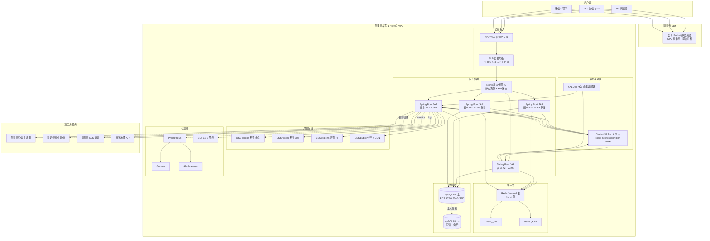

# 06 · 部署架构与运维（v1）

> 项目：仓储云
> 版本：v1 · 2026-06-02
> 编写：架构师 Agent
> 依赖：99-arch-decisions.md / 01-tech-stack.md / 02-modules.md / 03-database-schema.sql
> 状态：草案 → 待 Team Lead 复核

---

## 0. 文档说明

本文档定义试点期部署架构、容量估算、监控告警、CI/CD、备份策略、灾备与安全。所有运维实践遵循 ADR-006（单体多副本）、ADR-005（OSS）、ADR-008（异步队列）等已锁决策。

**阅读对象**：
- 运维：依据本文档准备阿里云资源 / 部署应用
- 后端开发：理解部署形态、JVM 参数、日志/监控埋点要求
- 测试：理解灾备场景设计测试用例
- Team Lead：评估云资源成本与上线节奏

---

## 1. 试点期部署架构

### 1.1 总体拓扑



### 1.2 部署形态选择（基于 ADR-006）

- **应用**：Spring Boot Fat JAR + Docker 镜像 + docker-compose（试点期）
- **副本**：起步 2 副本，按 QPS 弹性扩到 4 副本
- **负载均衡**：SLB（七层）→ Nginx（路径路由 + 静态资源）→ App
- **会话**：无状态（Sa-Token Token 存 Redis），Sticky Session 不强制
- **滚动升级**：一次一副本停机升级，保证最少 1 副本在线

### 1.3 v2 演进路径

| 触发条件 | 演进动作 |
|---|---|
| 副本数 > 6 | 迁移到 K8s（ACK），Helm Chart 管理 |
| 月增量请求 > 1000w | 引入 SkyWalking APM 全量采样 |
| 单租户 > 5000w 库存行 | tenant_id 水平分表 |
| 单租户 QPS > 500 | 拆分价格匹配 / 库存查询为独立服务 |

---

## 2. 容量估算（试点期）

### 2.1 业务体量假设

- 租户数：5 仓库
- 每仓批发商：50 WA（含 OPS 代建）
- 每仓终端：100 RT
- 平均每 WA SKU 数：200 个
- 平均日入库单：10/WA → 500/天/仓 → 2500/天/平台
- 平均日出库单：30/WA → 1500/天/仓 → 7500/天/平台
- 平均日询价单：50/RT → 5000/天/仓 → 25000/天/平台
- 平均日账单：月初批量生成 5 × 50 = 250 张/月

### 2.2 QPS / 并发估算

| 接口类型 | 峰值 QPS | 占比 |
|---|---|---|
| 浏览类（RT 询价前） | 30 | 60% |
| 出入库登记 | 5 | 10% |
| 询价 / 价格匹配 | 10 | 20% |
| 账单查询 | 3 | 6% |
| 其他 | 2 | 4% |
| **总计** | **50 QPS** | **100%** |

> 单副本 Spring Boot 设计承载 100 QPS，2 副本完全够用。预留 200% 余量。

### 2.3 存储估算（月增量）

| 类型 | 月增量 | 备注 |
|---|---|---|
| MySQL 业务数据 | ~ 5GB | 库存流水 / 操作日志 / 单据 |
| OSS photos | ~ 30GB | 入库照片，平均 200KB × 15w 张 |
| OSS voices | ~ 5GB | 语音 30 天滚动 |
| OSS exports | ~ 1GB | 账单 PDF/Excel，7 天滚动 |
| OSS public | ~ 2GB | 撮合资料 |
| **合计** | **~ 43GB/月** | 年化 ~ 500GB |

### 2.4 带宽估算

- 外网入口：峰值 20 Mbps（高峰期上传图片）
- 外网出口：峰值 50 Mbps（CDN 命中后回源 < 5%）
- VPC 内 ECS ↔ OSS：内网免费
- CDN：试点期月流量 ~ 200GB（公开静态资源命中）

### 2.5 DB 连接数

- 单应用副本 HikariCP min=10 max=50
- 4 副本最大 200 连接
- RDS 4C8G 默认连接数上限 1000，余量充足
- 慢查询阈值 500ms，超过自动报警

### 2.6 资源清单与月度成本估算

| 资源 | 规格 | 数量 | 月费（参考） |
|---|---|---|---|
| ECS 应用服务器 | ecs.c7.large 2C4G | 4（含 2 弹性）| ¥1,200 |
| RDS MySQL | mysql.x4.large.2c 4C8G 200G SSD | 1 主 1 备 | ¥1,800 |
| Redis 缓存 | redis.master.small.default 4G 主从 | 1 集群 | ¥600 |
| RocketMQ | TPS 100 标准版 | 1 | ¥400 |
| OSS | 标准存储 + 流量 | 500GB | ¥80 |
| CDN | 流量 200GB/月 | — | ¥50 |
| SLB | 标准型 + 流量 | 1 | ¥150 |
| WAF | 基础版 | 1 | ¥300 |
| 短信 | 5000 条/月 | — | ¥225 |
| NLS 语音 | 100 小时/月 | — | ¥1,260 |
| 高德地图 | 100w 次/日 免费 | — | ¥0 |
| ELK 日志 | 日志服务 SLS 100GB | — | ¥350 |
| **合计** | | | **~ ¥6,415 / 月** |

> 不含人力、域名、SSL 证书、备份冷存等周边成本。

---

## 3. 监控告警

### 3.1 监控层级

| 层 | 工具 | 采集 | 用途 |
|---|---|---|---|
| 基础设施 | 阿里云监控 + Prometheus Node Exporter | CPU / 内存 / 磁盘 / 网络 | 资源告警 |
| 应用 | Micrometer + Prometheus | JVM / HTTP 请求 / DB 连接池 / MQ | 业务指标 |
| 业务 | 自定义 Counter / Gauge | 单据量 / 账单生成 / 价格匹配耗时 | 业务监控 |
| 日志 | Logback + Filebeat + ELK | INFO/WARN/ERROR | 全链路检索 |
| 链路 | SkyWalking Agent（可选） | TraceId | APM |

### 3.2 关键监控指标

#### 应用层

| 指标 | 阈值 | 告警级别 |
|---|---|---|
| HTTP 5xx 错误率 | > 0.5% / 5min | P1 |
| HTTP P99 延迟 | > 2s / 5min | P2 |
| 价格匹配 P99 | > 200ms | P2 |
| JVM 老年代使用率 | > 80% | P2 |
| GC 暂停 | 单次 > 1s | P1 |
| 应用宕机 | 探活失败 ≥ 3 次 | P0 |

#### 数据层

| 指标 | 阈值 | 告警级别 |
|---|---|---|
| MySQL CPU | > 80% / 5min | P1 |
| MySQL 慢查询 | > 10 条/分钟 | P2 |
| MySQL 主从延迟 | > 5s | P1 |
| Redis 内存使用率 | > 80% | P2 |
| Redis 主从切换 | 发生 | P1 |

#### 业务层

| 指标 | 阈值 | 告警级别 |
|---|---|---|
| 短信发送失败率 | > 1% / 5min | P1 |
| 账单生成失败 | 单次 | P2 |
| 询价提交失败率 | > 5% / 5min | P2 |
| OSS 上传失败率 | > 2% / 5min | P2 |
| 多租户数据泄漏（TenantInterceptor 警报） | 发生 | P0 |

### 3.3 告警通道

| 级别 | 通道 | 响应时间 |
|---|---|---|
| P0 | 钉钉机器人 + 电话 + 短信 | 5 分钟内 |
| P1 | 钉钉机器人 + 短信 | 15 分钟内 |
| P2 | 钉钉机器人 | 1 小时内 |
| P3 | 邮件汇总（日报） | 次日 |

### 3.4 Dashboard（Grafana）

模板：
1. **总览大盘**：QPS / 错误率 / 副本数 / 告警计数
2. **JVM 大盘**：堆内存 / GC / 线程
3. **DB 大盘**：连接池 / QPS / 慢查询 / 主从延迟
4. **业务大盘**：日单据量 / 账单 / 询价确认率
5. **第三方大盘**：短信 / OSS / 高德调用量与成功率

---

## 4. CI/CD

### 4.1 工具链

| 阶段 | 工具 |
|---|---|
| 代码托管 | GitLab（自建） |
| CI | GitLab CI Runner（Docker executor） |
| 镜像仓库 | 阿里云 ACR（容器镜像服务） |
| 制品库 | Nexus 3（Maven / npm 私服） |
| 部署 | Ansible playbook（试点期）→ K8s Helm（v2） |
| 配置中心 | application-{env}.yml + 阿里云 KMS（敏感信息） |

### 4.2 流水线（.gitlab-ci.yml）

```yaml
stages:
  - test
  - build
  - quality
  - deploy

test-backend:
  stage: test
  script:
    - mvn -B clean test jacoco:report
    - mvn -B test -Dtest='**/*IT'  # Testcontainers 集成测试
  coverage: '/Total.*?(\d+\.\d+)%/'
  artifacts:
    reports:
      junit: '**/target/surefire-reports/*.xml'

build-backend:
  stage: build
  script:
    - mvn -B clean package -DskipTests
    - docker build -t $ACR/cangchu-cloud:$CI_COMMIT_SHORT_SHA .
    - docker push $ACR/cangchu-cloud:$CI_COMMIT_SHORT_SHA

quality-gate:
  stage: quality
  script:
    - mvn checkstyle:check
    - mvn spotbugs:check
    - sonar-scanner

deploy-dev:
  stage: deploy
  environment: dev
  only: [develop]
  script:
    - ansible-playbook deploy.yml -e env=dev image=$ACR/cangchu-cloud:$CI_COMMIT_SHORT_SHA

deploy-prod:
  stage: deploy
  environment: prod
  only: [main]
  when: manual  # 人工审批
  script:
    - ansible-playbook deploy.yml -e env=prod image=$ACR/cangchu-cloud:$CI_COMMIT_SHORT_SHA --tags rolling
```

### 4.3 滚动升级策略

每副本依次：
1. SLB 摘除流量
2. 等待请求结束（grace 30s）
3. 拉新镜像启动
4. 健康检查（`/actuator/health` 连续 3 次 OK）
5. SLB 挂回
6. 下一副本

升级总时长：4 副本 × 3 分钟 ≈ 15 分钟，期间最少 3 副本在线。

### 4.4 灰度发布（v2 规划）

- 引入 K8s Service + Istio
- 按 tenant_id hash 选 10% 灰度副本
- 灰度 24h 无报错 → 全量推
- 异常 → 一键回滚镜像

### 4.5 数据库 Migration

- Flyway 内嵌：应用启动时自动执行新 SQL
- 大表 DDL（如 alter add index）→ 提前在低峰运维窗口手工执行
- Migration 文件命名：`V{version}__{description}.sql`
- 禁止 `pt-osc` / `gh-ost` 之外的在线 DDL 工具

---

## 5. 备份策略

### 5.1 MySQL 备份

| 类型 | 频率 | 保留 | 工具 |
|---|---|---|---|
| 全量 | 每日 02:00 | 30 天 | RDS 自动备份 |
| binlog | 实时 | 7 天 | RDS 自动 |
| 跨区冷备 | 每周 | 90 天 | RDS 异地备份 → OSS 跨区 |
| 手工逻辑备份 | 重大变更前 | 60 天 | `mysqldump` → OSS |

### 5.2 恢复测试

- 每月演练：从前一日全量 + binlog 恢复到独立实例
- 每季度演练：跨区数据恢复
- 失败演练时间 < RTO 4 小时

### 5.3 Redis 备份

- RDB 持久化：每日 03:00
- AOF：每秒 fsync
- 主从切换 + Sentinel 自动恢复

### 5.4 OSS 备份

- photos / voices Bucket 开启版本控制
- 重要 Bucket 开启跨区域复制（华东 1 → 华北 2）
- 跨区延迟 < 15 分钟

### 5.5 应用配置备份

- 所有 application-{env}.yml 进 GitLab 仓库（敏感字段引用 KMS）
- KMS 密钥每季度轮换
- 配置变更通过 PR 流程

---

## 6. 灾备与高可用

### 6.1 SLA 目标（试点期）

| 维度 | 目标 |
|---|---|
| 可用性 | 99.9% / 月（停服 ≤ 43 分钟） |
| RTO | ≤ 4 小时 |
| RPO | ≤ 5 分钟（MySQL binlog 同步） |
| 数据持久性 | OSS 99.9999999%（11 个 9） |

### 6.2 故障场景与应对

| 故障 | 检测 | 应对 |
|---|---|---|
| 单 App 副本宕机 | SLB 健康检查 30s | 自动摘除流量 + Kubernetes 重启（或 Ansible 拉起） |
| Nginx 宕机 | SLB 后端探活 | 自动切换到另一 Nginx |
| MySQL 主宕机 | RDS 自动主从切换 | RTO ≤ 60s |
| Redis 主宕机 | Sentinel 自动选主 | RTO ≤ 30s |
| RocketMQ 节点宕机 | 集群自愈 | 生产者本地缓存重试 |
| 阿里云华东 1 区域故障 | 人工 | 启动跨区灾备（v2） |
| 短信主通道故障 | 连续 3 次失败 | 自动切腾讯云 |
| 高德地图故障 | 连续 5 次 5xx | 切腾讯地图（接口抽象层） |
| ASR 服务故障 | 连续 3 次失败 | 兜底人工补录 |

### 6.3 应急预案

| 等级 | 现象 | 应对动作 | 决策人 |
|---|---|---|---|
| P0 | 全平台不可用 | 启动应急群 → 评估恢复 → 必要时切灾备 → 通知所有租户 | CTO |
| P1 | 单模块不可用 | 模块降级（如关闭语音） → 切灰度通道 → 客服公告 | 架构师 |
| P2 | 单租户问题 | OPS 介入排查 | OPS Lead |

---

## 7. 安全

### 7.1 网络安全

- 阿里云 WAF 全量接入：OWASP Top 10 默认规则 + 自定义 SQL 注入 / XSS
- SLB 仅 443 端口对外，强制 HTTPS（HTTP 重定向 301）
- VPC 内部安全组：仅 Nginx ↔ App，App ↔ DB/Redis/MQ
- 公网 IP 仅 SLB + 跳板机（堡垒机）
- 跳板机 SSH 强制堡垒机审计（阿里云堡垒机）

### 7.2 SSL / TLS

- 域名 HTTPS：阿里云 SSL 证书（Let's Encrypt 备用）
- TLS 1.2+ 强制；禁用 SSLv3 / TLSv1.0/1.1
- HSTS 头开启（max-age=31536000）
- 证书每 90 天自动续期 + 监控到期

### 7.3 数据加密

- **传输加密**：所有 API HTTPS；DB / Redis 连接走 VPC 内网（不加密但隔离）
- **存储加密**：
  - RDS 透明数据加密（TDE）开启
  - OSS 服务端加密（SSE-KMS）开启
  - 敏感字段（手机号 hash、营业执照号）应用层 AES 加密
- **密码**：BCrypt cost ≥ 10（PRD §16.2）
- **Token**：Sa-Token 默认 UUID + 签名

### 7.4 密钥管理

- 阿里云 KMS 托管所有 AK/SK / DB 密码 / 第三方 API Key
- 应用启动时通过 RAM 角色拉取（不在配置文件存明文）
- KMS 密钥每季度轮换
- CI 流水线扫描禁用明文密钥（git-secrets）

### 7.5 访问审计

- 所有 OPS 操作（代建 / 仲裁 / 黑名单）全量审计（operation_log，ADR-014）
- 跨租户查询必须显式 `TenantContext.clearForGlobalQuery()`，触发日志
- 数据库审计：RDS SQL Audit 开启，留存 90 天
- 应用日志：6 个月归档至 OSS 冷存

### 7.6 合规

| 项 | 状态 |
|---|---|
| ICP 备案 | 上线前完成 |
| 等保 2.0 三级 | v2 推进（试点期 二级） |
| 个人信息保护法 | 用户协议 + 隐私政策完成 |
| 短信签名工信部备案 | 见 99 ADR W-02 |
| 语音录音 30 天保留合规 | 见 99 ADR W-03 |

---

## 8. 日志规范

### 8.1 日志级别

| 级别 | 使用场景 |
|---|---|
| ERROR | 系统异常、需要人工介入 |
| WARN | 业务异常、降级行为、限流触发 |
| INFO | 关键业务事件（登录 / 单据状态变更 / 账单生成） |
| DEBUG | 仅 dev 环境，生产关闭 |

### 8.2 日志格式（JSON）

```json
{
  "@timestamp": "2026-06-02T10:30:00.123+08:00",
  "level": "INFO",
  "logger": "com.cangchu.document.InboundService",
  "thread": "http-nio-8080-exec-3",
  "traceId": "5f3e8c9a-2b1d-4567-89ab-cdef01234567",
  "userId": "184237892374823400",
  "tenantId": "184237892374820000",
  "module": "DOCUMENT",
  "action": "REGISTER_INBOUND",
  "docNo": "IN-CC01-20260602-000045",
  "message": "Inbound registered, qty=200"
}
```

### 8.3 敏感数据脱敏

| 字段 | 脱敏规则 |
|---|---|
| 手机号 | `138****8000` |
| 身份证 | `110101********1234` |
| 营业执照 | `91*****X` |
| 密码 | 永不打印 |
| Token | 仅显示前 8 位 |

### 8.4 日志归档

- 应用日志：本地 30 天 → Filebeat → ELK 90 天 → OSS 冷存 6 个月
- 操作日志：MySQL 分区表 6 个月 → OSS 冷存（GZ 压缩）

---

## 9. 定时任务清单（XXL-Job）

| Job | Cron | 用途 | 告警 |
|---|---|---|---|
| DailySnapshotJob | `0 0 0 * * ?` | 每日 0 点库存快照 | 失败 P1 |
| CapacitySnapshotJob | `0 */10 * * * ?` | 每 10 分钟容量刷新 | 失败 P2 |
| ExpiryScanJob | `0 0 1 * * ?` | 每日 01:00 临期扫描 | 失败 P2 |
| BillGenerateJob | `0 0 0 1 * ?` | 每月 1 日 00:00 账单生成触发 | 失败 P1 |
| Inbound72hAutoConfirmJob | `0 */10 * * * ?` | 每 10 分钟扫描 72h 到期入库单 | 失败 P2 |
| VoiceCleanJob | `0 30 2 * * ?` | 每日 02:30 清理 30 天前语音 | 失败 P3 |
| OperationLogArchiveJob | `0 0 3 1 * ?` | 每月 1 日 03:00 归档 6 个月前日志 | 失败 P3 |
| SmsProviderHealthJob | `0 0 * * * ?` | 每小时短信备份通道自检 | 失败 P2 |

---

## 10. 环境矩阵

| 环境 | 用途 | 数据 | 部署副本 | 备注 |
|---|---|---|---|---|
| local | 本地开发 | 内置 H2 / mock | 1 | docker-compose |
| dev | 联调 | 测试数据 | 1 | 自动 deploy on develop merge |
| test | QA 测试 | 准生产 | 2 | 手动 deploy |
| staging | 预发布 | 生产同步脱敏 | 2 | 上线前最后一站 |
| prod | 生产 | 真实数据 | 2-4 | 灰度发布 |

---

## 11. 上线 Checklist

| 项 | 完成状态 |
|---|---|
| 阿里云资源申请（ECS / RDS / Redis / OSS / RocketMQ） | ☐ |
| 域名 + SSL 证书 | ☐ |
| ICP 备案 | ☐ |
| 短信签名 + 8 模板备案 | ☐ |
| 高德地图企业版 Key | ☐ |
| 阿里云 NLS 开通 | ☐ |
| WAF 规则配置 | ☐ |
| Prometheus + Grafana 部署 | ☐ |
| ELK 部署 | ☐ |
| 告警钉钉机器人 | ☐ |
| 数据库 Migration 执行 | ☐ |
| 初始化数据（OPS 账号 / SPU 标准库 / 公告模板） | ☐ |
| 灰度租户名单（首批 1-2 个仓库） | ☐ |
| 灾备演练通过 | ☐ |
| 安全扫描通过（SAST / DAST） | ☐ |
| 性能压测通过（100 QPS × 30min 稳定） | ☐ |
| 客服话术 + 运营手册 | ☐ |
| 应急预案演练 | ☐ |

---

## 12. 运维 SOP（速查）

| 场景 | 操作 |
|---|---|
| 紧急回滚 | `ansible-playbook rollback.yml -e image=<last-good>` |
| 应用扩容 | `ansible-playbook scale.yml -e replicas=4` |
| DB 慢查询排查 | 阿里云 RDS 控制台 → SQL 洞察 |
| Redis 大 key 排查 | `redis-cli --bigkeys` |
| 用户被踢出但需恢复 | OPS 后台 → 用户 → 解冻 |
| 短信发不出去 | 查发送通道健康状态 → 必要时切备份 |
| 单租户慢 | 查 tenant_id 索引命中 + 慢查询日志 |

---

## 13. 变更记录

| 版本 | 日期 | 变更 |
|---|---|---|
| v1 | 2026-06-02 | 首版 · 试点期部署架构 |

---

> 架构师交付完毕。下游：后端 Agent 按 02-modules.md + 03-database-schema.sql 落地；前端 Agent 按 04-api-spec.md 对接；测试 Agent 按 05-error-codes.md 编写异常场景。
