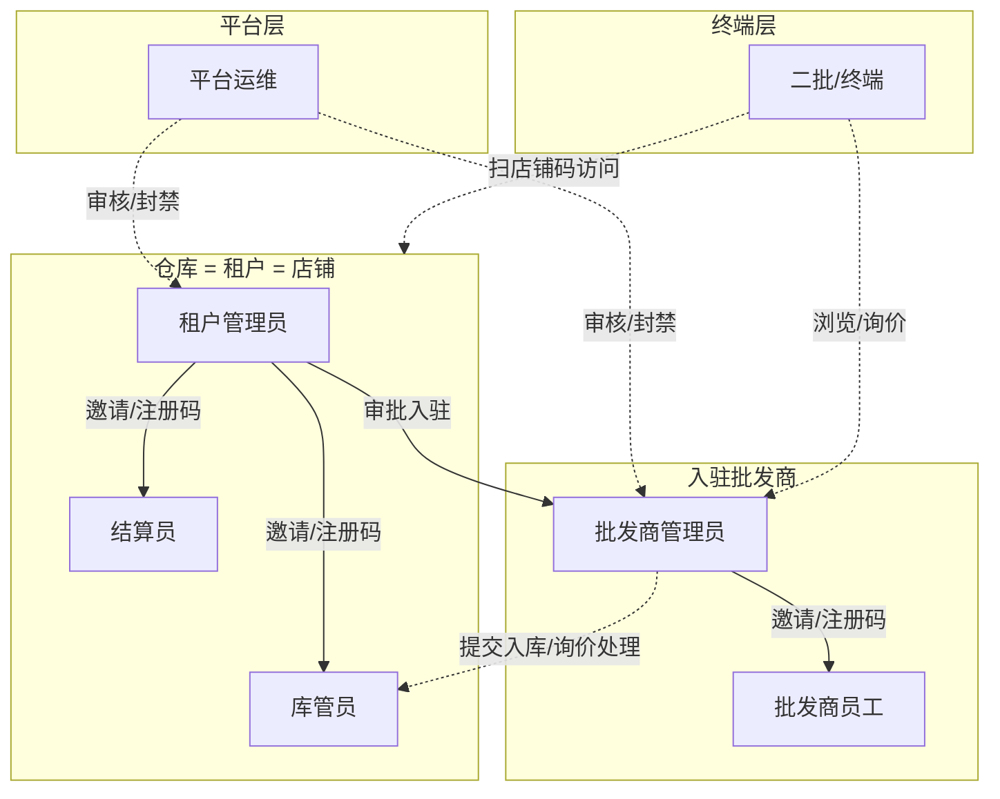
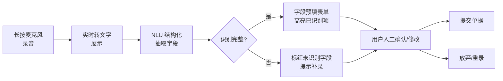

# 01 · 角色与权限矩阵（v1）

> 项目：仓储云（通用仓储 SaaS 平台）
> 版本：v1 · 2026-05-29
> 编写：产品设计 Agent
> 状态：草案 → 待 Team Lead / 用户确认

---

## 1. 用户分层全景

平台共 3 层主体、7 类账号：

| 主体层 | 角色 | 账号归属 | 是否多租户隔离 |
|---|---|---|---|
| 平台层 | 平台运维 | 平台 | 全局 |
| 租户层（仓库 = 店铺） | 租户管理员、库管员、结算员 | 仓库 | 按租户隔离 |
| 入驻商户层 | 批发商管理员、批发商员工 | 批发商 | 按租户内的批发商隔离 |
| 终端层 | 二批 / 终端 | 个人/小店 | 无隔离，平台公开访问 |

仓库与租户、店铺 = **1:1:1 绑定**（一个仓库 = 一个租户 = 一个店铺）。

---

## 2. 角色总览图

---

## 3. 七类角色职责

### 3.1 平台运维（OPS）

**身份**：平台员工。
**核心职责**：
- 仓库（租户）入驻审核、资质审核、上下线
- 批发商跨租户黑名单、违规处理
- SPU（标准品库）维护：新增/合并/下架
- 平台公告、版本发布、系统监控
- 客诉仲裁（不涉及资金）

**关键限制**：
- 不接触任何资金流水
- 不能查看单租户内部经营明细（除被举报/客诉外）

---

### 3.2 租户管理员（TA · 仓库老板/店长）

**身份**：仓库所有者或授权店长，**注册即开租户**。
**核心职责**：
- 店铺信息：名称、地址、营业时间、店铺码、对外公告
- 员工管理：生成员工注册码、分配内部角色（库管员/结算员）
- 入驻管理：审批批发商入驻申请、设置入驻条件
- 计费规则：设置仓储费单价（**支持件·天 / 托盘·天 两种计费维度**），临期阈值
- 账单总览：查看本店账单汇总（不参与结算操作）
- 撮合店铺页：维护店铺简介、主推商品、置顶批发商

**关键说明**：
- 租户管理员**可以同时担任库管员、结算员**（同一手机号兼任多角色，权限取并集），适配小仓库一人多岗场景
- 店铺码 = 终端入口（扫码进店）；员工注册码 = 员工注册校验（防止外人冒注册）

---

### 3.3 库管员（WK · 仓库现场操作员）

**身份**：仓库现场员工，由租户管理员通过员工注册码邀请。
**核心职责**：
- **入库**：受理批发商提交的入库申请，核对货物 → 入库登记（SKU、批次号、保质期、件数、占用托盘数）
- **出库**：受理批发商提交的出库申请，按 FIFO 提示拣货 → 打印出库单 → 实际出库登记
- **库存盘点**：日常盘点、差异调整、报损报溢
- **临期预警处理**：查看临期商品列表，通知批发商
- **移库**：仓内换位、调整货位（如启用货位功能）

**托盘记录方式（简化版）**：
- 入库时只录入「本次占用托盘数 N」作为整体属性，不绑定具体 SKU/批次
- 出库时按本次出库件数推算释放托盘数（或库管员手动调整）
- 不维护「某托盘上具体放了哪批货」的明细映射

**关键限制**：
- 不能修改计费规则、不能查看账单金额
- 不能修改批发商资料、不能审批入驻
- 单笔差异 > 阈值需租户管理员二次确认

---

### 3.4 结算员（ST · 仓库财务/账房）

**身份**：仓库财务人员，由租户管理员邀请。
**核心职责**：
- 月度账单生成：按计费规则（件·天 / 托盘·天）自动累计仓储费
- 账单核对、调整（折扣、减免、补收）
- 账单下发（推送给批发商管理员）
- 收款登记：批发商**线下付款后**手工登记「已收款」状态
- 账单导出（PDF / Excel）
- 历史账单查询

**关键限制**：
- **平台不经手资金**：结算员只记录「应收/已收」状态，不处理实际支付
- 不能修改单价、不能修改库存数据

---

### 3.5 批发商管理员（WA · 入驻仓库的批发商老板）

**身份**：入驻某仓库的批发商负责人。**一个批发商账号只能入驻一个仓库**（同一批发商进多个仓库需重复注册不同账号）。
**核心职责**：
- 入驻申请：选择仓库 → 提交资质 → 等待租户管理员审批
- 员工管理：生成本批发商员工注册码、分配权限
- 商品上架：基于平台 SPU 创建本批发商 SKU，定价、设置库存可见范围
- 入库申请：发起入库申请单 → 等待库管员受理（**支持语音下单**）
- 出库申请：发起出库申请单 → 等待库管员受理（**支持语音下单**）
- **询价处理（核心）**：
  - 接收二批/终端发来的询价/意向单
  - 确认 / 拒绝 / 议价回复
  - **意向单一旦确认 → 系统自动生成出库申请单**（带入意向单的 SKU/批次/件数/收货信息）→ 进入库管员出库队列
- 撮合资料：维护本批发商介绍、主推 SKU、营业资质
- 账单接收：查看本批发商月度仓储费账单、申请调整

**关键说明**：
- 自营批发商场景：仓库本身想做批发业务时，由租户管理员**手动创建一个自营批发商账号**走相同流程（不自动绑定）
- 平台不参与询价 → 出库的资金流，自动转换只完成单据流转

---

### 3.6 批发商员工（WE · 批发商业务员）

**身份**：批发商业务员，由批发商管理员邀请。
**核心职责**：
- 商品上下架、库存可见性维护
- 录入入库申请、出库申请（提交给库管员）
- 处理询价/意向单（在批发商管理员授权下确认）
- 客户跟进、报价

**关键限制**：
- 不能修改批发商基础资料、不能审批员工
- 不能查看账单金额（仅看库存与单据）

---

### 3.7 二批 / 终端（RT · 买家）

**身份**：终端零售商、餐饮采购、个人买家。**无需账号即可浏览**，下单/询价需手机号登录。
**核心职责**：
- 扫店铺码或平台首页进入仓库店铺页
- 浏览本店入驻批发商的商品、库存、价格
- 提交询价/意向单（指定 SKU / 件数 / 收货信息 / 留言，**支持语音下单**）
- 查看意向单状态（已提交 / 已确认 / 已拒绝）
- 线下与批发商完成交易

**关键限制**：
- 不参与平台资金流
- 不能直接修改库存、不能查看其他终端的询价

---

## 4. 权限矩阵（功能 × 角色）

> 图例：✅ 完全权限 · 🔵 受限/部分权限 · ❌ 无权限 · — 不适用

### 4.1 店铺与租户管理

| 功能 | OPS | TA | WK | ST | WA | WE | RT |
|---|---|---|---|---|---|---|---|
| 租户入驻审核 | ✅ | — | — | — | — | — | — |
| 租户上下线 | ✅ | — | — | — | — | — | — |
| 店铺基础资料维护 | 🔵看 | ✅ | ❌ | ❌ | — | — | — |
| 店铺码生成 | ❌ | ✅ | ❌ | ❌ | — | — | — |
| 员工注册码生成 | ❌ | ✅ | ❌ | ❌ | ✅本商户 | ❌ | — |
| 内部角色分配 | ❌ | ✅ | ❌ | ❌ | 🔵本商户 | ❌ | — |

### 4.2 入驻与商户管理

| 功能 | OPS | TA | WK | ST | WA | WE | RT |
|---|---|---|---|---|---|---|---|
| 批发商入驻申请 | — | — | — | — | ✅ | ❌ | — |
| 批发商入驻审批 | ❌ | ✅ | ❌ | ❌ | — | — | — |
| 批发商封禁/下架 | ✅ | ✅本店 | ❌ | ❌ | — | — | — |
| 批发商资料维护 | 🔵看 | 🔵看 | ❌ | ❌ | ✅本商户 | 🔵看 | 🔵看 |
| 创建自营批发商 | ❌ | ✅ | ❌ | ❌ | — | — | — |

> 备注：租户管理员可同时持有库管员 / 结算员角色，权限取**并集**；不强制角色互斥。

### 4.3 商品与库存

| 功能 | OPS | TA | WK | ST | WA | WE | RT |
|---|---|---|---|---|---|---|---|
| SPU 维护（平台标品） | ✅ | ❌ | ❌ | ❌ | 🔵申请 | ❌ | — |
| SKU 创建（批发商商品） | ❌ | ❌ | ❌ | ❌ | ✅本商户 | ✅本商户 | — |
| SKU 公开价（单价/起批价/起批量） | ❌ | ❌ | ❌ | ❌ | ✅本商户 | 🔵授权 | — |
| 客户专属价管理（含批量调价/失效）| ❌ | ❌ | ❌ | ❌ | ✅本商户 | 🔵授权 | — |
| 入库申请提交（**支持语音下单**） | ❌ | ❌ | ❌ | ❌ | ✅ | ✅ | — |
| 入库受理 / 实际入库登记 | ❌ | 🔵兼任 | ✅ | ❌ | ❌ | ❌ | — |
| 出库申请提交（**支持语音下单**） | ❌ | ❌ | ❌ | ❌ | ✅ | ✅ | — |
| 出库受理 / 打印 / 实际出库 | ❌ | 🔵兼任 | ✅ | ❌ | ❌ | ❌ | — |
| 库存盘点 / 差异调整 | ❌ | 🔵兼任 | ✅ | ❌ | ❌ | ❌ | — |
| 批次/保质期登记 | ❌ | 🔵兼任 | ✅ | ❌ | 🔵填写 | 🔵填写 | — |
| 临期预警查看 | 🔵看 | ✅本店 | ✅本店 | ❌ | ✅本商户 | ✅本商户 | — |
| 托盘占用数录入（简化版） | ❌ | 🔵兼任 | ✅ | ❌ | ❌ | ❌ | — |

### 4.4 撮合与询价

| 功能 | OPS | TA | WK | ST | WA | WE | RT |
|---|---|---|---|---|---|---|---|
| 店铺撮合页编辑 | ❌ | ✅ | ❌ | ❌ | — | — | — |
| 批发商撮合资料 | 🔵看 | 🔵看 | ❌ | ❌ | ✅本商户 | 🔵编辑 | 🔵看 |
| 浏览商品 / 库存 / 价格 | ✅ | ✅ | ✅ | ✅ | ✅ | ✅ | ✅ |
| 提交询价 / 意向单（**支持语音下单**） | ❌ | ❌ | ❌ | ❌ | ❌ | ❌ | ✅ |
| 询价确认 / 拒绝 / 议价 | ❌ | ❌ | ❌ | ❌ | ✅本商户 | 🔵授权 | — |
| 意向单 → 出库申请自动生成 | — | — | 🔵接单 | — | ✅触发 | 🔵授权 | — |
| 查看本人意向单状态 | — | — | — | — | — | — | ✅ |

### 4.5 计费与结算

| 功能 | OPS | TA | WK | ST | WA | WE | RT |
|---|---|---|---|---|---|---|---|
| 计费规则设置（件·天 / 托盘·天 / 单价 / 临期阈值） | ❌ | ✅ | ❌ | ❌ | — | — | — |
| 月度账单自动生成 | ❌ | 🔵看 | ❌ | ✅审核 | — | — | — |
| 账单调整（折扣/减免） | ❌ | 🔵看 | ❌ | ✅ | 🔵申请 | ❌ | — |
| 账单下发 | ❌ | 🔵看 | ❌ | ✅ | — | — | — |
| 已收款登记（线下回款） | ❌ | 🔵看 | ❌ | ✅ | ❌ | ❌ | — |
| 账单导出 | ❌ | ✅本店 | ❌ | ✅本店 | ✅本商户 | ❌ | — |
| 账单接收 / 查看 | — | — | — | — | ✅本商户 | ❌ | — |

### 4.6 平台运营

| 功能 | OPS | TA | WK | ST | WA | WE | RT |
|---|---|---|---|---|---|---|---|
| 平台公告 | ✅ | 🔵看 | 🔵看 | 🔵看 | 🔵看 | 🔵看 | 🔵看 |
| 客诉受理 / 仲裁 | ✅ | 🔵看本店 | ❌ | ❌ | 🔵看本商户 | ❌ | 🔵提交 |
| 系统监控 / 日志 | ✅ | ❌ | ❌ | ❌ | ❌ | ❌ | ❌ |
| 数据导出（平台级） | ✅ | ❌ | ❌ | ❌ | ❌ | ❌ | ❌ |

---

## 5. 关键边界与原则

1. **资金不过平台**：平台只发账单、记状态，所有支付（仓储费、撮合货款）均线下进行，平台无任何资金流。
2. **数据按租户隔离**：除 OPS 外，所有角色只能看本租户/本商户/本人数据。
3. **角色可兼任（同租户内）**：租户管理员可同时担任库管员、结算员；权限取并集，便于小仓库一人多岗。
4. **店铺码与员工注册码分离**：店铺码对外用于扫码进店，员工注册码对内用于员工注册校验。
5. **意向单 → 出库申请全自动**：批发商管理员确认意向单的瞬间，系统自动生成出库申请单，无需库管员/批发商再次手动录入。
6. **托盘采用简化管理**：只在入库时录占用托盘数，不维护「托盘 ↔ SKU/批次」明细；计费按托盘·天累计。
7. **自营批发商需手动创建**：仓库想做批发不会自动开账号，必须由租户管理员手动建一个批发商账号走标准流程。
8. **语音下单覆盖三类单据**：入库申请、出库申请、询价/意向单均支持语音录入；详细规则见 §6。

---

## 6. 语音下单规则

### 6.1 适用范围

| 单据类型 | 发起角色 | 入口端 | 必备字段（识别目标） |
|---|---|---|---|
| 入库申请 | 批发商管理员 / 批发商员工 | H5 / 小程序 | SKU 名称、批次号、生产/到效期、件数、占用托盘数（可选）、备注 |
| 出库申请 | 批发商管理员 / 批发商员工 | H5 / 小程序 | SKU 名称、件数、收货人、收货地址、提货时间、备注 |
| 询价 / 意向单 | 二批 / 终端 | 店铺码 H5 | SKU 名称、件数、收货信息、留言 |

### 6.2 交互流程

**关键交互点**：
1. 录音入口 = 各单据创建页右上角「🎤 语音下单」按钮，松开自动停止（≤60 秒/次，超时强制停止）
2. **实时转写**：录音过程中文字实时显示，便于用户判断识别质量
3. **预填即可改**：识别后的字段必须落在表单输入框，用户可逐项修改而非整段重录
4. **强制人工确认**：识别完成后**绝不直接提交**，必须用户点击「确认提交」按钮才正式落单

### 6.3 字段识别规则

| 字段类型 | 处理策略 |
|---|---|
| SKU 名称 | 模糊匹配本商户已有 SKU 库；多个匹配时弹候选列表让用户选择；零匹配则标红待手填 |
| 数字字段（件数 / 托盘数） | 中文数字 + 阿拉伯数字均支持（"三十件" / "30 件"）；零识别则置空待手填 |
| 日期 | 支持相对（"今天"/"明天"/"后天"）+ 绝对（"5 月 20 号"）；歧义日期标红 |
| 收货信息 | 优先匹配本人历史收货地址；新地址则原文填入"地址"字段 |
| 备注 / 留言 | 未抽取到结构化字段的剩余文本统一进备注 |

### 6.4 兜底与异常

| 场景 | 处理 |
|---|---|
| 录音权限被拒 | 提示"请在系统设置开启麦克风权限"，提供手动录入入口 |
| 网络中断 | 本地暂存录音 30 分钟，恢复后允许重传识别 |
| 识别引擎不可用 | 自动降级为「文字描述输入」，文本框 + NLU 抽取 |
| 识别置信度 < 阈值 | 字段标黄提示"识别不确定，请核对" |
| 必备字段缺失 | 提交按钮置灰，未填字段红框标注 |
| 多次失败（连续 3 次） | 弹"切换到表单录入"提示，引导回归手填流程 |

### 6.5 权限与安全

- **权限校验**：语音下单不绕过角色权限 —— 无权创建该单据的角色，语音按钮也不显示
- **租户隔离**：SKU 匹配只在本商户/本租户范围内查找，不跨租户
- **操作留痕**：单据保存原始录音文件（保留 30 天）+ 转写文本 + 识别版本号，便于纠纷追溯
- **隐私提示**：首次使用时弹窗告知"语音将上传识别并保留 30 天"，用户同意后方可使用

### 6.6 MVP 范围约束

- **MVP 仅支持普通话识别**，方言（粤语、川渝、东北等）排到 v2
- **MVP 仅支持单 SKU 录入**（一次语音 → 一条明细行），多 SKU 合并下单排到 v2
- **MVP 不做声纹身份核验**，仍依赖账号登录态识别用户

---

## 7. 待定事项（已收口）

| # | 项 | 状态 | 决议 |
|---|---|---|---|
| Q1 | 托盘装载关系颗粒度 | ✅ 已定 | A. 简化版，只录占用托盘数 |
| Q2 | 意向单 → 出库申请转换方式 | ✅ 已定 | A. 全自动，确认即生成 |
| Q3 | 租户管理员兼任内部角色 | ✅ 已定 | 允许兼任，权限并集 |
| Q4 | 计费维度 | ✅ 已定 | 件·天 + 托盘·天 双维度 |
| Q5 | 自营批发商 | ✅ 已定 | 手动创建 |
| Q6 | 语音下单方言支持 | ✅ 已定 | MVP 仅普通话，方言留 v2 |
| Q7 | 语音下单多 SKU 合并 | ✅ 已定 | MVP 单 SKU，合并留 v2 |

---

> 下一步：02-用户故事 / 03-信息架构 / 04-核心流程 / 05-业务规则 / 06-页面线框 / 99-未决问题
