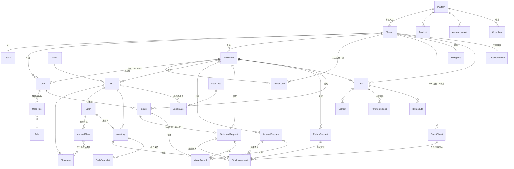

# 03 · 信息架构（v1）

> 项目：仓储云
> 版本：v1 · 2026-05-29
> 编写：产品设计 Agent
> 依赖：01-roles-and-permissions.md / 02-user-stories.md
> 状态：草案

---

## 0. 文档说明

本文档定义平台的**信息架构**，回答四个核心问题：

1. **核心实体（Entity）有哪些？** → §1
2. **实体之间如何关联？** → §2 ER 图
3. **关键实体的属性结构？** → §3 实体字段表
4. **各角色在产品中如何导航和查找信息？** → §4 导航地图、§5 信息层级、§6 全局搜索/筛选

> 仅描述"信息是什么 / 怎么组织"，不涉及数据库表设计、字段类型、索引等技术层面（归架构师 Agent）。

---

## 1. 核心实体清单

按业务域分组：

### 1.1 账号与组织域
| 实体 | 中文 | 说明 |
|---|---|---|
| Platform | 平台 | 全局唯一 |
| Tenant | 租户（仓库） | 多租户隔离单元 |
| Store | 店铺 | 与租户 1:1，对外展示载体 |
| User | 用户账号 | 手机号唯一，跨角色共用；含密码 hash（RT 可空）、昵称、姓名、状态 |
| Role | 角色 | OPS/TA/WK/ST/WA/WE/RT 7 种 |
| UserRole | 用户角色绑定 | 同一 User 可在同租户内兼任多角色（见 01 §3.2） |
| Wholesaler | 批发商（商户） | 入驻租户的批发商主体 |
| InviteCode | 注册码 | 店铺码 / 员工注册码 |
| SmsCode | 短信验证码 | (phone, scene, code, expire_at, used)，scene ∈ {register, login, reset_pwd, change_phone} |
| LoginSession | 登录会话 | (user_id, token, device, ip, ua, login_at, last_active, expire_at) |
| PasswordHistory | 密码历史 | 保留最近 3 次密码 hash，防重复 |

### 1.2 商品与库存域
| 实体 | 中文 | 说明 |
|---|---|---|
| SPU | 标准品 | 平台维护、全局共享 |
| SpecType | 规格类型 | 多维度，无模板（如"规格""产地""包装"） |
| SpecValue | 规格值 | SpecType 下的可选值（如"500g""加拿大"） |
| SKU | 商品 | 批发商级，SPU + 规格组合 + 自定义属性 + **公开价** |
| CustomerPrice | 客户专属价 | (RT 手机号, SKU) → 专属单价 + 有效期 + 沉淀来源 |
| PriceChangeLog | 调价日志 | 公开价 / 专属价的每次变动留痕 |
| SkuImage | SKU 展示图 | 标准图 / 入库实拍图（按批次）/ 双图轮播标记 |
| Batch | 批次 | SKU 下的入库批次（批次号 + 生产/到效期） |
| Inventory | 库存 | 按 SKU+Batch 维度的当前在库数 / 占用托盘数 |
| StockMovement | 流水 | 入库/出库/退货/盘盈/盘亏 5 种类型 |
| InboundPhoto | 入库照片 | 与 Batch 绑定，自动作为"实拍图"候选 |

### 1.3 单据域
| 实体 | 中文 | 说明 |
|---|---|---|
| InboundRequest | 入库申请单 | WA 发起 → WK 受理 |
| OutboundRequest | 出库申请单 | WA 发起 或 系统自动从 Inquiry 生成 |
| Inquiry | 询价/意向单 | RT 发起 → WA 处理 |
| ReturnRequest | 退货单 | WA 发起 → WK 受理 |
| CountSheet | 盘点单 | WK 发起，含盘盈/盘亏明细 → TA 审批 |
| ExpiryClearance | 临期清库单 | WK 发起 → TA 审批 |
| Application | 入驻申请 | WA → TA |
| WithdrawApplication | 退驻申请 | WA → TA |

### 1.4 计费与结算域
| 实体 | 中文 | 说明 |
|---|---|---|
| BillingRule | 计费规则 | 件·天 / 托盘·天 单价 + 临期阈值 |
| DailySnapshot | 每日库存快照 | 每日 0 点自动生成，作为计费输入 |
| Bill | 月度账单 | 一个 Tenant × Wholesaler × 月 = 1 张 |
| BillItem | 账单条目 | 含原始累计 + 调整 + 冲销条目 |
| PaymentRecord | 已收款登记 | 线下回款的手工登记 |
| BillDispute | 账单申诉 | WA 发起 → ST 处理 |

### 1.5 平台与运营域
| 实体 | 中文 | 说明 |
|---|---|---|
| TenantApplication | 租户入驻申请 | TA 提交 → OPS 审核 |
| Blacklist | 跨租户黑名单 | OPS 维护 |
| Announcement | 平台公告 | OPS 发布 |
| Complaint | 客诉单 | RT/WA 提交 → OPS 仲裁 |
| CapacityPublish | 容量公示设置 | TA 配置可见性档位（已入驻/全平台/不公开 + 精度） |

### 1.6 横向支撑域
| 实体 | 中文 | 说明 |
|---|---|---|
| VoiceRecord | 语音记录 | 三类单据的原始录音 + 转写文本，保留 30 天 |
| OperationLog | 操作日志 | 角色身份 + 动作 + 原值新值 |
| Notification | 通知 | 站内信 + 短信 |
| Attachment | 附件 | 照片、PDF、Excel |
| Address | 通用地址 | (text, lng, lat, source, precision)；被 Tenant 地址、RT 收货地址、退货地址等共用 |
| RTLocation | 终端临时位置 | RT 客户端本地缓存的最近坐标（≤7 天），用于推荐仓库；不持久化到 RT 个人资料 |

---

## 2. ER 关系图



---

## 3. 关键实体字段结构

> 仅列对产品/前端有意义的字段，不含技术字段（id/created_at/updated_at 等由架构师定义）。

### 3.1 Tenant（租户/仓库）
| 字段组 | 字段 |
|---|---|
| 基础 | 仓库名称、地址（含 lng/lat/精度/来源）、营业时间、联系电话、资质证照 |
| 店铺 | 店铺名、店铺码、店铺简介、主推商品、置顶批发商列表 |
| 容量 | 总容量(件)、总容量(托盘)、容量公示策略{已入驻/全平台/不公开}、精度档位{精确/模糊} |
| 计费 | 件·天单价、托盘·天单价、临期阈值天数 |
| 开关 | 批次管理开关、入库拍照开关 |
| 状态 | 待审核/正常/冻结/已下线 |
| 来源 | self_register / ops_created（含 ops_user_id） |

### 3.2 Wholesaler（批发商）
| 字段组 | 字段 |
|---|---|
| 基础 | 商户名、资质证照、联系人、电话 |
| 入驻 | 所属租户 ID、入驻时间、入驻状态、是否自营 |
| 撮合资料 | 商户介绍、主推 SKU 列表、营业资质照片 |
| 状态 | 待审核/正常/已下架/已退驻/争议中 |

### 3.3 SKU（商品）
| 字段组 | 字段 |
|---|---|
| 基础 | SPU 引用、商户引用、商品名、商品编码 |
| 规格 | 规格类型+值组合（多维度，自由组合） |
| 公开价 | 单价、起批价、起批量（最后一次调整时间、操作人） |
| 展示 | 展示图来源{标准图/入库实拍/双图轮播}、自定义详情图 |
| 库存可见 | 是否对外显示库存数 |
| 上架状态 | 上架/下架（手动下架后入库不自动恢复） |

### 3.3b CustomerPrice（客户专属价）
| 字段组 | 字段 |
|---|---|
| 主键 | (rt_phone, sku_id) 二元组唯一 |
| 价格 | 专属单价 |
| 有效 | 生效时间、过期时间（NULL = 永久）、状态 ∈ {生效, 已失效, 已过期} |
| 来源 | source ∈ {from_inquiry, manual_create, batch_copy}、关联询价单号（若有） |
| 审计 | 创建人、最近调整人、创建时间、最近调整时间 |
| 备注 | 自由文本（如"老客户协议价"） |

### 3.3c PriceChangeLog（调价日志）
| 字段组 | 字段 |
|---|---|
| 目标 | target_type ∈ {sku_public, customer_price}、target_id |
| 变化 | 调前价格、调后价格、调价方式（涨X% / 降X% / 改为¥X / 加减¥X / 失效）|
| 范围 | 批量调价时的批次号（同一批操作的多条 log 关联）、影响条目数 |
| 审计 | 操作人、操作时间、IP、调价原因（选填） |

### 3.4 Batch（批次）
| 字段组 | 字段 |
|---|---|
| 基础 | SKU 引用、批次号、生产日期、到效期 |
| 入库 | 入库申请单引用、入库照片列表、入库时间、占用托盘数 |
| 状态 | 在库/已售罄/已退/临期/已清库 |

### 3.5 InboundRequest（入库申请）
| 字段组 | 字段 |
|---|---|
| 头 | 批发商引用、提交人、提交时间、备注、语音记录引用（可选）、来源 source ∈ {wa_submit, wk_created} |
| 明细 | SKU 列表[SKU/批次号/生产日期/到效期/件数/占用托盘数] |
| 流转 | 状态{待受理/已撤回/已驳回/已受理/已入库 \| 待WA确认/已确认/争议中/已撤销}、库管员、驳回理由、入库照片、入库时间 |
| WK 代建专属 | 代建人 wk_user_id、72h 倒计时、确认人、确认时间、auto_accept 标记、异议理由、TA 仲裁结果 |
| 打印 | 入库单打印记录（次数、时间） |

### 3.6 OutboundRequest（出库申请）
| 字段组 | 字段 |
|---|---|
| 头 | 批发商引用、来源 source ∈ {wa_submit, inquiry_auto, wk_created}、原意向单引用、提交人、备注、语音记录引用（可选） |
| 收货 | 收货人、收货地址（地图坐标）、提货时间 |
| 明细 | SKU 列表[SKU/件数/指定批次(可选)] |
| 流转 | 状态{待受理/已撤回/已打印/已出库/已撤销/已纠错/客诉中}、库管员、出库时间、FIFO 实际批次 |
| WK 代建专属 | 代建人 wk_user_id、二次确认时间戳、大额校验标记、出库照片（建议必填）|
| 客诉 | 客诉单引用、OPS 仲裁结论 |
| 打印 | 出库单打印记录 |

### 3.7 Inquiry（询价/意向单）
| 字段组 | 字段 |
|---|---|
| 头 | 终端 RT 引用、批发商引用、所属租户、提交时间、语音记录引用（可选）、来源 source ∈ {rt_submit, wa_proxy} |
| 代下 | proxy_creator_id（WA/WE 代下时记录创建人）、代下时设备 IP |
| 明细 | SKU 列表[SKU/件数/匹配时单价（公开价 or 专属价快照）/小计] |
| 价格 | 原总价 = Σ 小计、整单优惠金额（≥0，≤原总价-0.01）、优惠备注、实付金额 = 原总价 - 整单优惠 |
| 议价 | 议价历史（多轮报价/还价）、最终成交单价 |
| 沉淀 | 是否沉淀为专属价、沉淀有效期 ∈ {永久, N天, 仅本次}（整单优惠**不**触发沉淀）|
| 流转 | 状态{已提交/议价中/已确认/已拒绝/已取消/已作废}、处理人、拒绝理由 |
| 联动 | 自动生成的出库单引用 |

### 3.8 Bill（账单）
| 字段组 | 字段 |
|---|---|
| 头 | 租户引用、批发商引用、账期月份、生成时间 |
| 明细 | BillItem 列表[日期/SKU/批次/件数/托盘数/件·天/托盘·天/小计] |
| 调整 | 折扣条目、减免条目、冲销条目（反向） |
| 金额 | 应收金额、已收金额、未收金额 |
| 流转 | 状态{待核对/已下发/待回款/部分回款/已结清/已撤回/争议中} |
| 回款 | PaymentRecord 列表 |
| 申诉 | BillDispute 列表 |

### 3.9 CountSheet（盘点单）
| 字段组 | 字段 |
|---|---|
| 头 | 租户引用、库管员、盘点时间、备注、附照片 |
| 明细 | [SKU/批次号/系统数/实物数/差异/盘盈or盘亏/批次归属（盘盈必填）] |
| 流转 | 状态{待审批/已通过/已驳回}、TA 审批人、审批时间、驳回理由 |

---

## 4. 角色导航地图

> 列出各角色 H5/PC 端的一级导航 + 二级页面。

### 4.1 平台运维（OPS · PC 端）
```
顶部导航：
├─ 工作台
├─ 租户管理
│  ├─ 待审核仓库
│  ├─ 已入驻仓库
│  └─ 已冻结
├─ 商品库（SPU）
│  ├─ 标品列表
│  └─ 合并/下架记录
├─ 批发商管控
│  ├─ 跨租户黑名单
│  └─ 入驻总览
├─ 客诉中心
├─ 平台公告
└─ 系统监控
```

### 4.2 租户管理员（TA · PC + H5）
```
PC 端主导航：
├─ 店铺工作台（实时容量/今日单据/账单提醒）
├─ 店铺设置
│  ├─ 基础资料
│  ├─ 店铺码 / 员工注册码
│  ├─ 容量公示设置 ⭐
│  └─ 计费规则（件·天 / 托盘·天 / 临期阈值）
├─ 员工管理
├─ 入驻批发商
│  ├─ 待审核
│  ├─ 已入驻
│  └─ 自营批发商管理
├─ 仓储运营（可下钻 WK 视图）
├─ 单据审批
│  ├─ 入库纠错单
│  ├─ 出库纠错单
│  ├─ 盘点单
│  ├─ 临期清库单
│  └─ 退驻申请
├─ 账单总览
└─ 站内信

H5 端（精简版）：工作台 / 单据审批 / 账单总览 / 容量公示开关
```

### 4.3 库管员（WK · H5 优先 + PC）
```
H5 底部 Tab：
├─ 入库 ⭐
│  ├─ 待受理列表
│  ├─ 拍照入库
│  ├─ 入库单打印
│  └─ 历史入库
├─ 出库 ⭐
│  ├─ 待受理列表（含意向单自动转）
│  ├─ FIFO 拣货
│  ├─ 出库单打印
│  └─ 历史出库
├─ 盘点
│  ├─ 新建盘点单
│  ├─ 临期预警
│  └─ 强制清库
├─ 库存查询（按 SKU/批次）
└─ 我的（操作日志/通知）
```

### 4.4 结算员（ST · H5 + PC，均为一等公民）
```
PC + H5 主导航：
├─ 工作台（本月账单进度、回款情况）
├─ 账单
│  ├─ 待核对
│  ├─ 已下发
│  ├─ 待回款
│  ├─ 已结清
│  └─ 撤回/冲销记录
├─ 已收款登记 ⭐
├─ 账单导出
├─ 申诉处理
└─ 历史账单查询
```

### 4.5 批发商管理员（WA · H5 优先 + PC）
```
H5 底部 Tab：
├─ 首页
│  ├─ 库存概览
│  ├─ 今日询价
│  └─ 容量告警 ⭐
├─ 商品（SKU）
│  ├─ 在售
│  ├─ 已下架
│  └─ 展示图设置（标准图/实拍图）⭐
├─ 单据
│  ├─ 入库申请（含语音）
│  ├─ 出库申请（含语音）
│  ├─ 退货申请
│  └─ 单据历史
├─ 询价处理 ⭐
│  ├─ 待处理
│  ├─ 已确认（自动转出库追溯）
│  └─ 已拒绝
└─ 我的
   ├─ 员工管理
   ├─ 我的仓库（容量/告警订阅）⭐
   ├─ 账单
   └─ 撮合资料

仓库广场（公开入口，未入驻 WA 也可访问，含登录后的"申请入驻"按钮）
```

### 4.6 批发商员工（WE · H5）
```
权限范围内的 SKU / 单据 / 询价（导航与 WA 相同但部分项灰显或隐藏）
```

### 4.7 二批 / 终端（RT · H5 + 小程序）
```
入口：
├─ 扫店铺码 → 店铺页
├─ 平台首页（推荐仓库 + 推荐批发商）
└─ 我的（手机号登录后）

店铺页 → 商品列表 → 商品详情 → 提交询价
我的：
├─ 我的意向单（已提交/已确认/已拒绝/已取消）
├─ 我的收货地址
├─ 历史询价 → 一键复购
└─ 账号注销
```

---

## 5. 信息层级（核心页面下钻路径）

### 5.1 库存查询的层级
```
仓库 / 批发商
 └─ SKU 列表
     └─ SKU 详情
         ├─ 当前总在库（件 + 托盘）
         ├─ 批次列表
         │   └─ 批次详情
         │       ├─ 批次基础（号/产/效）
         │       ├─ 在库件数 + 占用托盘数
         │       ├─ 入库照片
         │       ├─ 流水（入/出/退/盘盈/盘亏）
         │       └─ 计费累计（件·天/托盘·天）
         └─ 展示图设置（仅 WA 可见）
```

### 5.2 账单的层级
```
账单总览（按月份）
 └─ 单张账单（租户 × 批发商 × 月）
     ├─ 头部金额（应收/已收/未收）
     ├─ 明细分组
     │   ├─ 按日下钻 → 每日快照
     │   ├─ 按 SKU 下钻 → SKU 明细
     │   └─ 按批次下钻 → 批次明细
     ├─ 调整记录（折扣/减免/冲销）
     ├─ 回款记录（PaymentRecord 列表 + 凭证）
     └─ 申诉历史
```

### 5.3 询价 → 自动转出库的层级
```
询价单
 ├─ 头（RT/WA/SKU/件数/收货/留言/状态）
 ├─ 议价回复历史
 ├─ 语音录音（可选）
 └─ 关联出库单（确认后自动出现）
     └─ 出库单详情
         ├─ 来源标记"由意向单 #xxx 自动生成"
         ├─ FIFO 拣货明细
         └─ 出库照片（可选）
```

### 5.4 仓库容量信息层级
```
我的仓库（已入驻视角）/ 仓库广场（未入驻视角）
 └─ 仓库卡片（名称/地址/利用率/剩余容量）
     └─ 仓库详情页
         ├─ 基础信息（仅展示 TA 公开的部分）
         ├─ 容量明细（精确数 or 模糊档，按 TA 设置）
         ├─ 货位空闲数（若启用）
         ├─ 临期占用比例
         ├─ 容量告警订阅按钮（仅已入驻 WA/WE）
         └─ 申请入驻按钮（仅未入驻 WA）
```

---

## 6. 全局搜索与筛选

### 6.1 全局搜索入口（按角色）

| 角色 | 搜索范围 |
|---|---|
| OPS | 全平台 SPU / 仓库 / 批发商 / 客诉单 |
| TA | 本店 SKU / 批发商 / 入库/出库/盘点/退货/账单/申诉 |
| WK | 本店 SKU / 批次 / 入库/出库/盘点单 |
| ST | 本店账单 / 已收款记录 / 申诉 |
| WA | 本商户 SKU / 批次 / 单据 / 询价 / 账单 |
| WE | 本商户 SKU / 单据（按权限） |
| RT | 当前店铺商品 / 我的意向单 / 历史询价 |

### 6.2 单据筛选标准维度

所有单据列表统一支持：
- 状态多选
- 日期范围（默认近 30 天）
- 关联人（WA / WE / RT 名 或 手机号）
- 关键字（单号 / SKU 名）
- 排序（提交时间倒序 默认）

### 6.3 高频快捷筛选（按角色 H5 端预设）

| 角色 | 快捷视图 |
|---|---|
| WK | 今日待入库 / 今日待出库 / 临期 7 天 |
| WA | 待我确认询价 / 待回款账单 / 容量 < 20% |
| ST | 本月待核对 / 待下发 / 待回款 / 已逾期 |
| RT | 我的待确认意向单 / 已确认可线下提货 |

---

## 7. 跨实体引用规则

> 防止"数据孤岛"和"无主单据"。

1. **意向单 ↔ 出库单**：双向引用，作废/撤销时联动（R8 / S6）
2. **入库单 ↔ 批次 ↔ 入库照片**：批次必有入库单引用，照片必属于某批次
3. **批次 ↔ SKU 展示图**：照片可被引用为实拍图源，但 SKU 切换展示图时不删除照片本体
4. **盘点单 ↔ 流水**：审批通过才生成盘盈/盘亏流水
5. **账单 ↔ 流水**：账单明细按"租户 × 批发商 × 月 × 每日快照"聚合，可追溯到原始流水
6. **退驻 ↔ 库存 ↔ 账单**：主动退驻要求库存=0 + 账单结清（R13）；被动下架不强制（R14）
7. **冻结/封禁 ↔ 现有单据**：冻结只锁新单据，已生成的单据可继续完成（R14 / R15）

---

## 8. 时态与版本约定

| 实体 | 时态规则 |
|---|---|
| BillingRule | 修改不影响历史账单；当月分段计费（R20） |
| SKU 价格 | 修改不影响已确认意向单的价格 |
| SKU 展示图设置 | 修改即时生效，不追溯历史 |
| 容量公示策略 | 修改 1 分钟内全平台生效 |
| 入库照片 | 永久保留 |
| 语音录音 | 保留 30 天（01 §6.5） |
| 操作日志 | 永久保留 |
| 注销账户 | 7 天冷静期 + 永久脱敏（R16） |

---

> 下一步：04-核心流程（状态机 + 时序图 + 异常分支全集）
