# 04 · 核心流程（v1）

> 项目：仓储云
> 版本：v1 · 2026-05-29
> 编写：产品设计 Agent
> 依赖：01-roles-and-permissions.md / 02-user-stories.md / 03-information-architecture.md
> 状态：草案

---

## 0. 文档说明

本文档以**状态机 + 时序图 + 分支决策表**形式定义单据流转、异常分支和系统级自动化触发点：

- §1 单据状态机（含正向与逆向）
- §2 端到端时序图（关键链路）
- §3 异常与边界分支决策表
- §4 系统级定时任务与自动触发
- §5 通知触发矩阵
- §6 并发与一致性约束

不重复 02 用户故事中的"链路串联"，更聚焦"状态转换条件"和"系统行为"。

---

## 1. 单据状态机

### 1.1 InboundRequest（入库申请单）

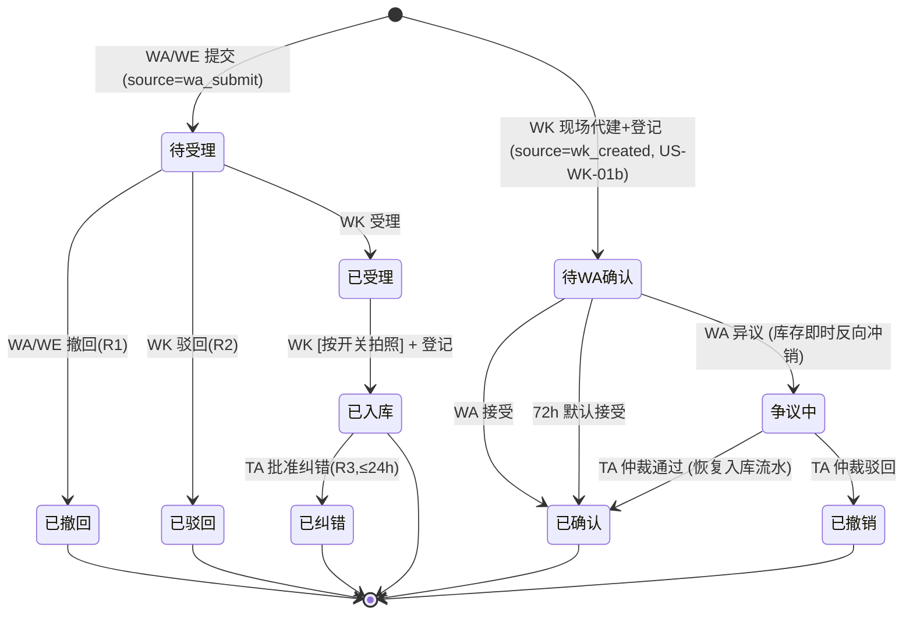

**关键转换约束**：
- 「待受理 → 已受理」时锁定该单据，防止 WA 二次撤回
- 「已受理 → 已入库」时**拍照行为由 TA 拍照开关决定**（关闭/选填/必填，见 02 US-TA-11）；必填档下未拍照则登记按钮置灰
- 「已入库 → 已纠错」仅在 24 小时窗口内允许，超时只能走 R5 退货
- **WK 代建入库**（US-WK-01b）：现场登记即生效，库存立即变化、计费起算；进入 WA「待确认」队列
- 「待 WA 确认 → 争议中」时库存即时反向冲销（一条反向流水），单据进入 TA 仲裁
- 「待 WA 确认」72h 倒计时归零 → 自动 `已确认（默认）`，状态机字段标记 `auto_accept=true`

### 1.2 OutboundRequest（出库申请单）

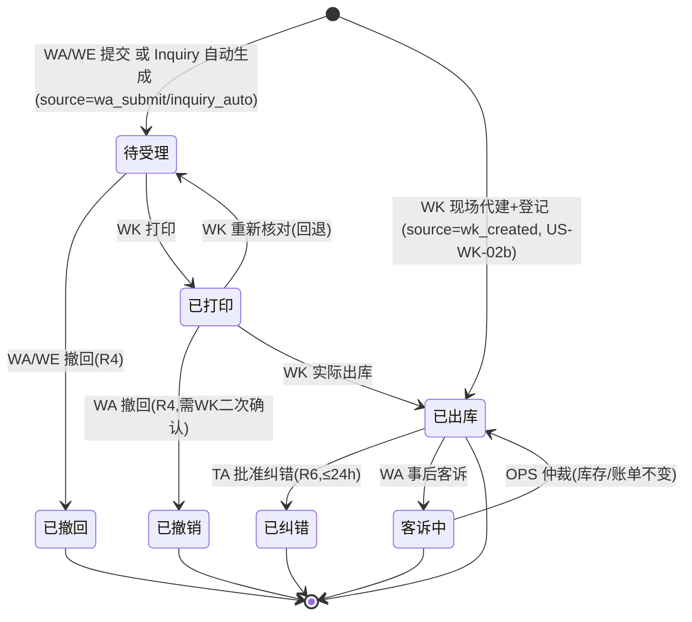

**关键转换约束**：
- 来源标记：`wa_submit` 手动 / `inquiry_auto` 意向单自动生成 / `wk_created` WK 现场代建
- 「已打印 → 已撤销」时若来源是意向单，需联动回滚意向单状态 → "待确认"
- 「已出库」生成出库流水后，原意向单（如有）状态保持"已确认"不再回滚
- **WK 代建出库（US-WK-02b）**：跳过所有前置态，直接登记为「已出库」，库存即时扣减；进入 WA「已确认（代建）」通知队列
- **WA 不能"异议"代建出库**（货已离仓不可逆补回），仅可事后走 `客诉中` 由 OPS 仲裁，OPS 仅出责任判定，**库存/账单不回滚**
- 代建出库前置须经显著二次确认弹窗 + 大额校验（单笔 > 在库 50%）

### 1.3 Inquiry（询价/意向单）

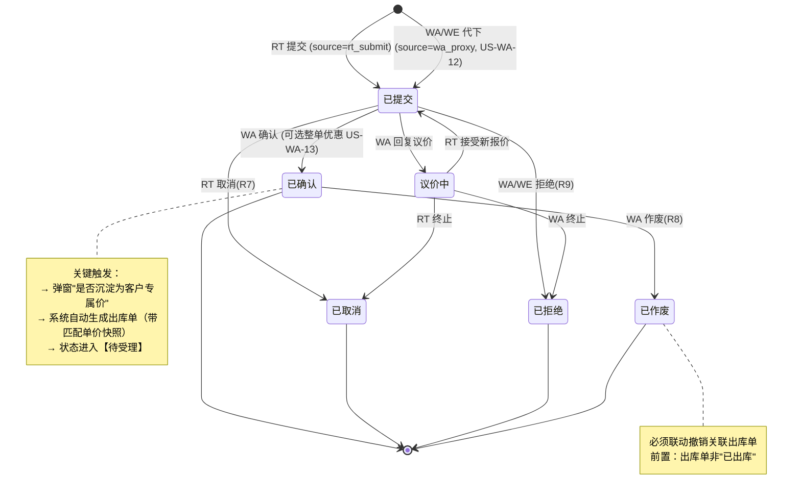

**议价沉淀关键点**：
- 沉淀触发：议价确认时若成交价 ≠ 公开价，**必弹**沉淀选择
- 默认选项：「沉淀为永久专属价」
- 选项集：`本次一次性` / `永久专属价` / `专属价 N 天`
- 沉淀写入 CustomerPrice，关联原询价单号；调价日志同步落 PriceChangeLog
- 沉淀失败不阻塞出库单生成（出库单按议价确认价）

### 1.3b PriceMatching（价格匹配算法）

```mermaid
graph LR
    A[RT 浏览/询价] --> B{是否登录}
    B -- 未登录 --> C[只显示 SKU 公开价]
    B -- 已登录 --> D[查 CustomerPrice<br/>(手机号, SKU)]
    D -- 命中且生效 --> E[显示专属价<br/>+ 小标识]
    D -- 未命中 --> F{件数 ≥ 起批量?}
    F -- 是 --> G[显示起批价]
    F -- 否 --> H[显示单价]
```

### 1.4 Bill（账单）

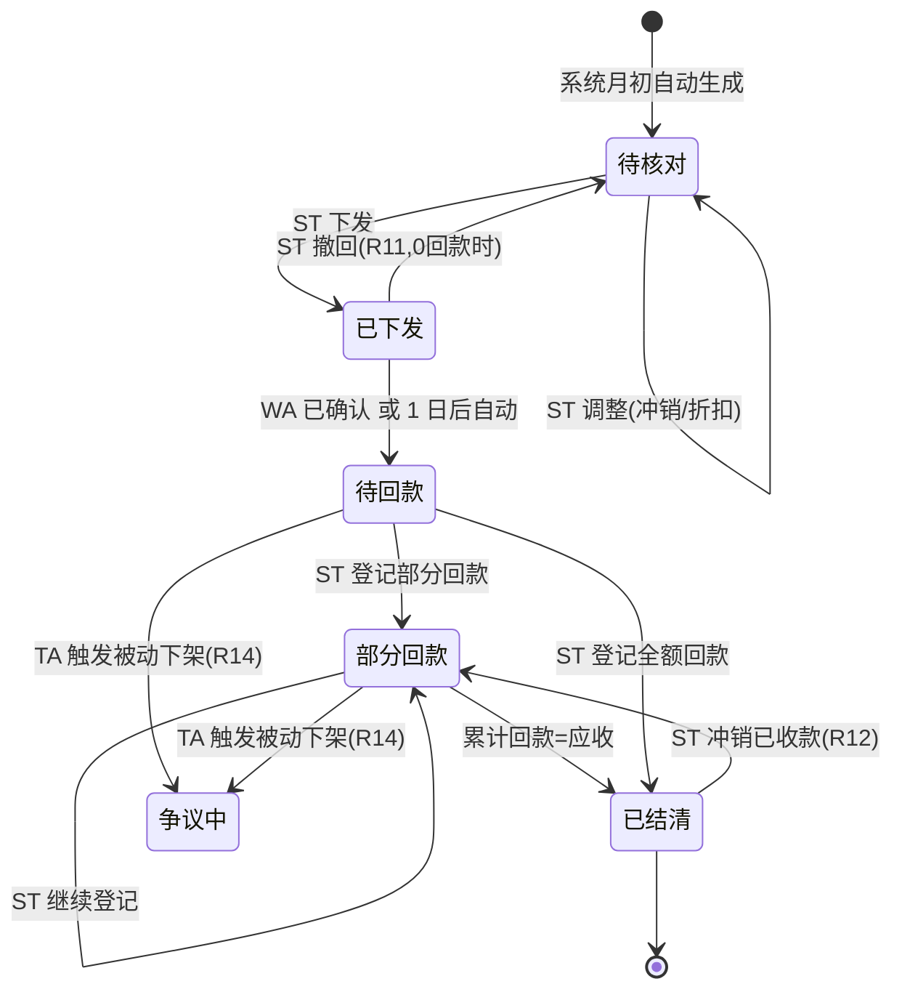

### 1.5 CountSheet（盘点单）

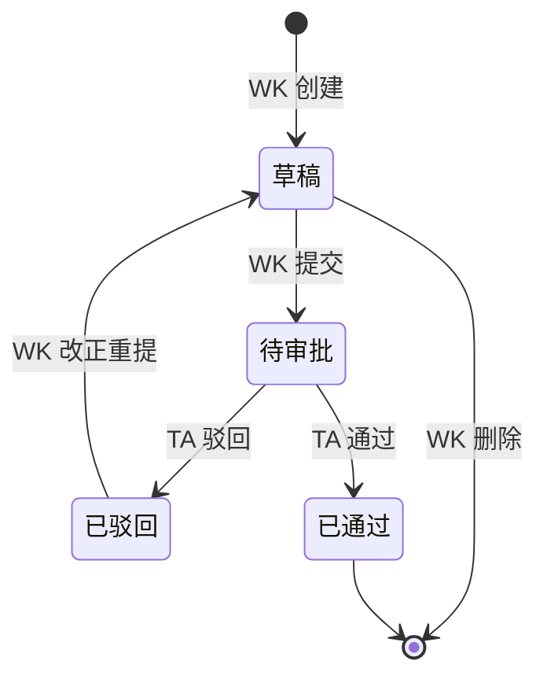

**通过后副作用**：
- 盘盈条目 → 生成 `盘盈` 流水 → 库存数 +N + 计费起算
- 盘亏条目 → 生成 `盘亏` 流水 → 库存数 -N + 计费截止

### 1.6 ReturnRequest（退货单）

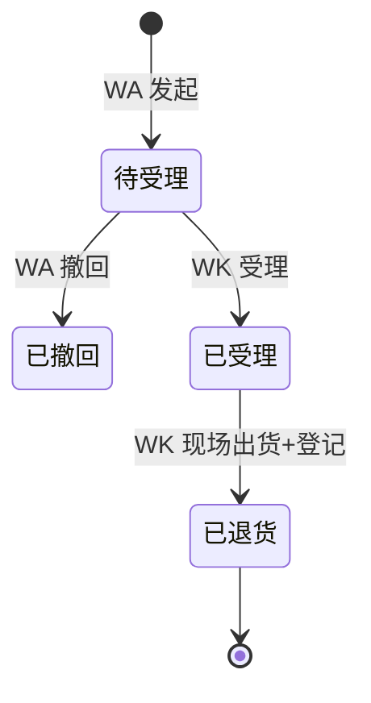

### 1.7 TenantApplication（租户入驻）

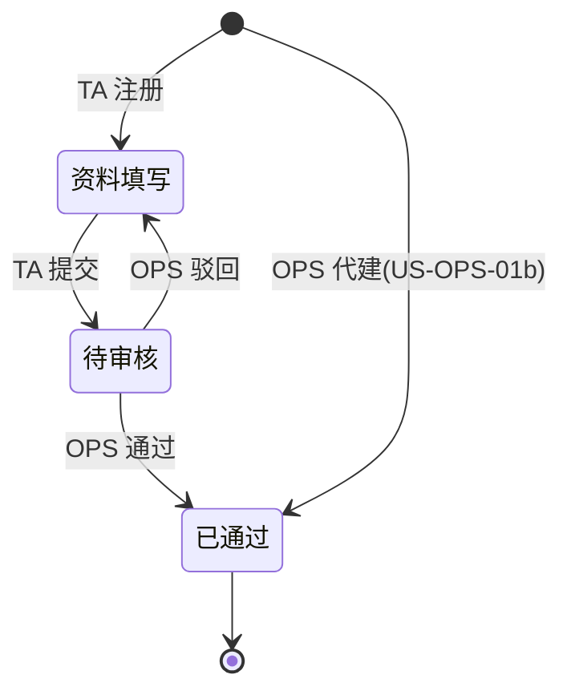

> 两条入口：TA 自助注册（走待审核 → 已通过）+ OPS 代建（直接 = 已通过，跳过审核队列）。

### 1.8 Wholesaler 入驻关系状态机

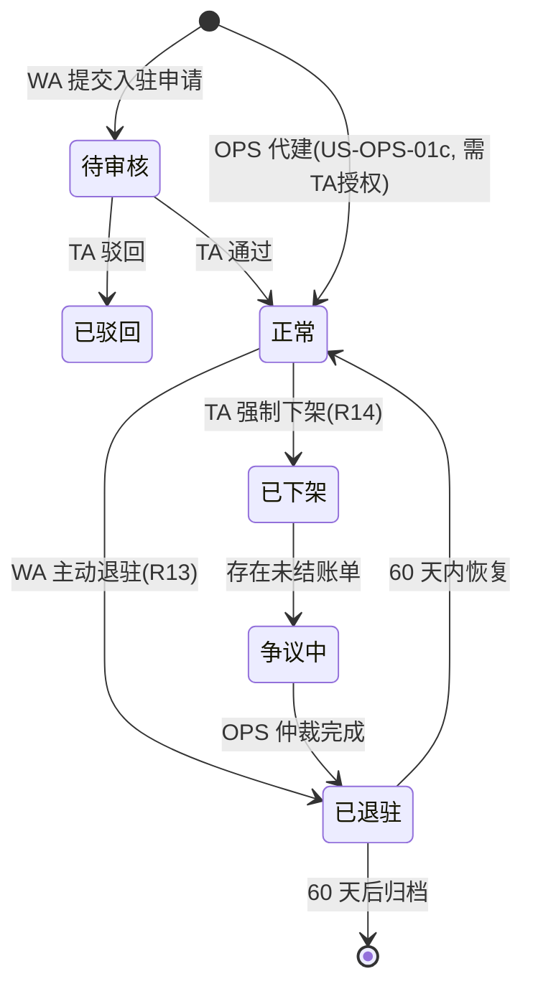

> 两条入驻入口：WA 自助申请（走 TA 审批）+ OPS 代建（直接=正常，需 TA 授权前置）。

---

## 2. 端到端时序图

### 2.1 询价 → 自动出库（核心路径）

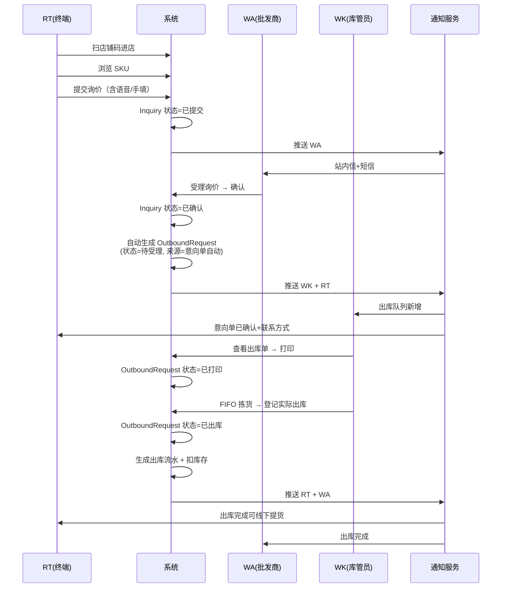

### 2.2 拍照入库 + 自动上架（按开关）

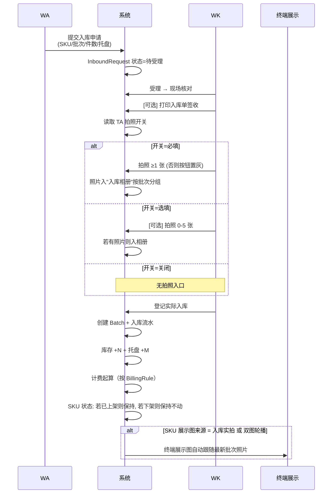

### 2.3 月度账单全链路

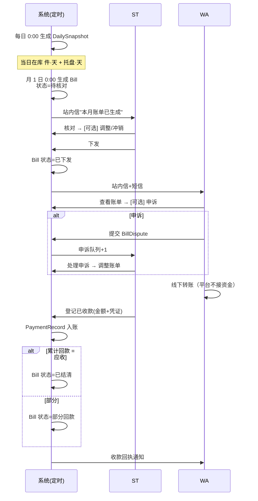

### 2.4 盘点差异处理

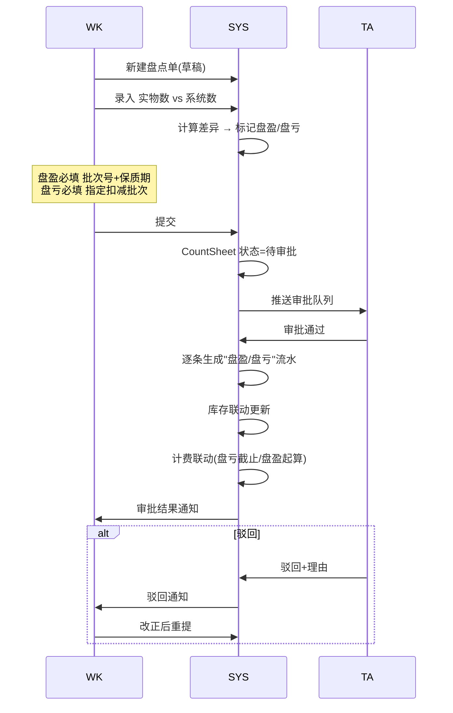

### 2.5 一人多岗（TA 兼 WK + ST）

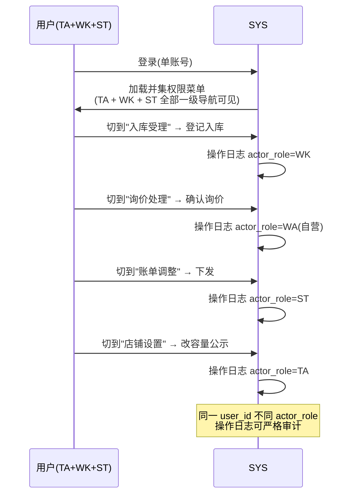

---

## 3. 异常与边界分支决策表

### 3.1 入库异常

| 场景 | 决策 |
|---|---|
| 实物与申请数量不符 ≤ 5% | WK 直接按实物登记，备注差异；不驳回 |
| 数量不符 > 5% | WK 驳回(R2)，要求 WA 重新提交 |
| 批次号缺失（仅批次开关=启用时校验） | 不允许登记，前端表单校验 |
| 保质期已过期（仅批次开关=启用时校验） | 弹窗强警告 → WK 二次确认方可登记 |
| 保质期 < 临期阈值（仅批次开关=启用时校验） | 警告但允许登记 → 入库后立即进入临期预警列表 |
| 批次开关=关闭时的入库 | 跳过批次/保质期/临期判断，仅校验件数+SKU |
| WK 代建入库（无 WA 申请） | 直接登记，库存立即变化；WA 端「待确认」队列；72h 自动默认接受 |
| WA 异议代建入库 | 库存即时反向冲销（一条反向流水），单据「争议中」，TA 仲裁 |
| WK 代建出库（无 WA 申请） | 直接登记为已出库，库存即时扣减；必经二次确认弹窗；单笔 > 在库 50% 弹大额校验；WA 端通知「已确认（代建）」 |
| WA 对代建出库提客诉 | 库存不回滚（货已离仓）；状态转「客诉中」；OPS 仲裁仅判责，不改账 |
| 拍照失败/无网络（开关=必填） | 本地暂存，恢复后补传；超 24h 未补传则单据回退到"已受理"重新拍 |
| 拍照失败/无网络（开关=选填） | 提示后可选择"无照片登记" |
| 拍照开关变更后历史照片 | 既有照片保留，可继续作为 SKU 实拍展示图 |

### 3.2 出库异常

| 场景 | 决策 |
|---|---|
| 库存不足（拣货时） | 拒绝出库，提示当前可用库存，WA 需修改单据或撤回 |
| 指定批次缺货但其他批次有 | FIFO 提示替代批次，WK 选择是否替换 |
| 收货信息缺失 | 表单校验拦截，不能提交 |
| 来源意向单已被作废 | 出库单自动联动撤销(R8) |
| 已打印但实物已被混拣 | 不可逆，按实际拣货登记，备注差异 |

### 3.3 询价异常

| 场景 | 决策 |
|---|---|
| 询价 SKU 已下架 | RT 端列表不可见，已提交的存量询价 WA 端标"商品已下架"，可拒绝或换 SKU 议价 |
| 询价件数 > 当前可见库存 | 允许提交（议价空间），WA 决定是否拆单/拒绝 |
| RT 提交后未登录手机号 | 拦截，强制登录；草稿暂存 30 分钟 |
| WA 离线 24h 未处理 | 系统站内信催办；72h 未处理自动标"过期"，RT 端通知 |

### 3.4 账单异常

| 场景 | 决策 |
|---|---|
| 当月新入库批次的计费基准日 | 按"次日 0 点"起算（避免半天歧义） |
| 当月退货批次的计费截止日 | 按"退货日当天"截止（含当天） |
| 计费规则当月变更（R20） | 分段计费：变更前用旧规则，变更日及之后用新规则 |
| 已结清账单需冲销 | 必须先 R12 冲销已收款 → 状态回退 → 再走 R10 |
| 应收为 0（极端情况） | 仍生成账单，状态直接=已结清，方便后续追溯 |

### 3.5 容量公示异常

| 场景 | 决策 |
|---|---|
| 库存系统短暂故障 | 容量页展示"数据更新中"提示，使用最后一次成功快照 |
| TA 频繁切换公示策略 | 1 分钟内最多 3 次，超频则禁用 5 分钟（防滥用） |
| 数据 > 10 分钟未刷新 | 自动重试 + 告警到 OPS 监控 |

### 3.6 语音下单异常

| 场景 | 决策 |
|---|---|
| 录音 < 1 秒 | 视为误触，不进入识别 |
| 录音 > 60 秒 | 强制停止，已录部分继续识别 |
| 识别置信度 < 阈值 | 字段标黄"识别不确定"，强制人工确认 |
| 连续 3 次识别全失败 | 弹"切换文字输入"引导 |
| 网络中断时录制 | 本地缓存 30 分钟，恢复后允许重传 |

### 3.7 拍照开关变更的联动

| 场景 | 决策 |
|---|---|
| 开关切到"关闭" | SKU 展示图若用"入库实拍/双图轮播"自动回退到"标准图"，通知 WA |
| 开关切到"必填"且当前有进行中入库单 | 已"已受理"的单据继续按旧规则；新受理的按新规则 |
| 开关切到"选填" | 不影响任何进行中单据 |

### 3.8 批次开关变更的联动

| 场景 | 决策 |
|---|---|
| 开关切到"关闭"（启→关） | 已有批次保留独立库存状态，按老 FIFO 顺序出完为止；新入库不再录批次；临期预警停用；展示图"入库实拍"按"最新一次入库"取 |
| 开关切到"启用"（关→启） | 系统为每个 in_stock > 0 的 SKU 自动生成「默认批次」占位（批次号=`DEFAULT-{YYYYMMDD}`，保质期空），FIFO 时该批次时间戳=切换时刻；新入库走完整批次流程 |
| 进行中的入库/出库单 | 按提交时的开关策略走完，不切换中途规则 |
| 切换频次限制 | 24h 内最多 2 次（防滥用） |
| 切到关闭时的临期预警 | 已生成的预警/清库单继续处理完，但不再产生新预警 |

### 3.9 入库表单字段（按批次开关）

| 字段 | 关闭 | 启用 |
|---|---|---|
| SKU | 必填 | 必填 |
| 件数 | 必填 | 必填 |
| 占用托盘数 | 选填 | 选填 |
| 批次号 | 隐藏 | 必填 |
| 生产/到效期 | 隐藏 | 必填 |

---

## 4. 系统级定时任务与自动触发

| 触发时机 | 任务 | 影响实体 | 失败处理 |
|---|---|---|---|
| 每日 00:00 | 生成 DailySnapshot（按 SKU+批次） | DailySnapshot | 重试 3 次 + OPS 告警 |
| 每日 02:00 | 扫描临期阈值 → 生成临期预警 | Batch | 重试 |
| 每日 02:30 | 扫描保质期归零 → 标"待清理" | Batch | 重试 |
| 每月 1 日 00:00 | 生成上月 Bill | Bill, BillItem | 重试 + ST 站内信确认 |
| 每 10 分钟 | 刷新容量公示快照 | CapacityPublish 缓存 | 沿用上次快照 + 告警 |
| 询价 24h 未处理 | WA 催办通知 | Notification | — |
| 询价 72h 未处理 | 自动标过期 | Inquiry | — |
| 退驻 60 天 | 归档 | Wholesaler | — |
| 注销 7 天 | 永久脱敏 | User | — |
| 语音录音 30 天 | 删除 | VoiceRecord | — |

---

## 5. 通知触发矩阵

> 站内信 = 必发；短信 = 关键节点；推送 = 移动端。

| 触发事件 | 站内信 | 短信 | 推送 | 接收方 |
|---|---|---|---|---|
| 入库申请提交 | ✅ | — | ✅ | 库管员 |
| 入库驳回(R2) | ✅ | — | ✅ | WA |
| 出库申请提交 | ✅ | — | ✅ | 库管员 |
| 出库已完成 | ✅ | ✅ | ✅ | WA / RT |
| 询价提交 | ✅ | — | ✅ | WA |
| 询价确认/拒绝/取消 | ✅ | ✅ | ✅ | RT |
| 自动生成出库单 | ✅ | — | ✅ | 库管员 |
| 意向单作废联动撤销出库 | ✅ | ✅ | ✅ | WK + RT |
| 临期预警 | ✅ | — | ✅ | 库管员 + WA |
| 强制清库 | ✅ | ✅ | ✅ | WA |
| 盘点单待审批 | ✅ | — | ✅ | TA |
| 盘点驳回/通过 | ✅ | — | ✅ | WK |
| 账单生成 | ✅ | — | ✅ | ST |
| 账单下发 | ✅ | ✅ | ✅ | WA |
| 账单撤回 | ✅ | ✅ | ✅ | WA |
| 已收款登记 | ✅ | — | ✅ | WA |
| 已收款冲销(R12) | ✅ | ✅ | ✅ | WA |
| 容量告警(<20%) | ✅ | — | ✅ | WA / WE（订阅者） |
| 容量公示策略变更 | ✅ | — | — | 所有入驻 WA |
| 计费规则变更(R20) | ✅ | ✅ | ✅ | 所有入驻 WA |
| 拍照开关切到关闭(展示图回退) | ✅ | — | ✅ | 受影响的 WA |
| 入驻审核通过/驳回 | ✅ | ✅ | ✅ | WA / TA |
| 强制下架(R14) | ✅ | ✅ | ✅ | WA |
| 租户冻结(R15) | ✅ | ✅ | ✅ | TA + 全员工 + 入驻 WA |
| 注销冷静期/完成(R16) | ✅ | ✅ | — | RT |
| OPS 代建租户 (US-OPS-01b) | ✅ | ✅ | — | 被代建的 TA |
| OPS 代建批发商 (US-OPS-01c) | ✅ | ✅ | ✅ | 被代建的 WA + 该租户 TA |

---

## 6. 并发与一致性约束

### 6.1 库存并发

| 场景 | 约束 |
|---|---|
| 同一批次多个出库单同时拣货 | 拣货登记按"先到先得"分配实际批次，库存不足则后到者失败 |
| 库存扣减 vs 盘点单审批 | 盘点单审批生成流水时，对涉及批次加行锁，拣货等待 |
| 入库登记 vs 拍照（开关=必填） | 登记前必须完成拍照（事务内）；拍照失败回滚库存增量 |

### 6.2 状态机一致性

| 场景 | 约束 |
|---|---|
| 意向单确认 → 自动生成出库单 | 同一事务内完成（成功则两边一致，失败则回滚） |
| 意向单作废 → 撤销出库单 | 校验出库单非"已出库"为前置；若拣货中（"已打印"）需 WK 二次确认 |
| 账单下发 vs ST 调整 | 已下发状态下不能直接改金额，必须先 R11 撤回 |

### 6.3 计费一致性

| 场景 | 约束 |
|---|---|
| DailySnapshot 重复执行 | 幂等：同一日只保留一份快照 |
| 当月新入库批次重复计费 | 按"次日 0 点"起算（防止当天既算新规则又算旧规则） |
| 账单生成失败重试 | 幂等：同一(租户, 批发商, 月)只生成一张账单 |

### 6.4 通知幂等

| 场景 | 约束 |
|---|---|
| 系统重复推送同一事件 | 同 event_id 24h 内只发一次 |
| 短信失败 | 重试 3 次后落库为"发送失败"，不阻塞业务 |

---

> 下一步：05-业务规则（计费公式、FIFO 算法、权限校验细则、状态校验细则）
